<!-- DRAFT-BANNER-START -->
> ⚠️ **WORKING DRAFT — for the next release.** Edit *this* file (`MANUAL-SA.draft.md`) for every user-facing change as it lands. The **released** manual is `MANUAL-SA.md` — do **not** edit it directly; `scripts/cut_release.sh` promotes this draft into `MANUAL-SA.md` (banner stripped) at release time.
>
> **This is the only manual under active development.** `MANUAL.md` documents dAVEBOx running as an ordinary tool on official Schwung and is **frozen** at its final release — do not edit it, and do not port changes into it.
<!-- DRAFT-BANNER-END -->

# The dAVEBOx SA Manual

dAVEBOx is a **MIDI sequencer for the Ableton Move**. It records, arranges, and
plays back MIDI — notes and automation — and sends it to an instrument. It makes
no sound of its own: the sound comes from whatever each track is pointed at, which
is one of Move's own instruments, a Schwung effect chain, or an external synth on
the USB-A port.

dAVEBOx runs inside [Schwung](https://github.com/charlesvestal/schwung) and takes
over Move's pads, knobs, and screen while it's open. It borrows Move's vocabulary —
tracks and clips — and a **Like Move** note flags where something works as
it does on Move.

> 🚀 **New here?** The [**Quick Start guide**](QUICKSTART.md) walks you from a
> blank set to a running arrangement in about fifteen minutes. This manual is the
> full reference.

## Which manual is this?

This manual describes **dAVEBOx SA** — dAVEBOx running as its own session, on its
own build of the Schwung host. It restarts Move underneath and boots straight into
the sequencer. Everything described here assumes that. **This is where dAVEBOx is
developed.**

**There are two ways in, and they lead to exactly the same place:**

| | how |
|---|---|
| **From Schwung** | open **dAVEBOx** in official Schwung's **Tools** menu |
| **At power-on** | while the screen reads *"Loading Schwung — press Back to change"*, hold **Back**, turn the jog to **dAVEBOx** and click |

The boot route needs official Schwung 1.3.0 or newer, which is what draws that
picker. On anything older the Tools route is simply the way in, and nothing is
missing.

⚠ **Picking a row in that boot menu also makes it your default**, so the next
power-on goes straight there without asking. To change back, hold Back again and
pick **Schwung**. Leaving dAVEBOx always returns you to Schwung either way — the
default only decides what a cold boot does.

If you run dAVEBOx the other way — as an ordinary tool you open from inside
official Schwung — read [`MANUAL.md`](MANUAL.md) instead. That version still works
and is unchanged, but it is **no longer being developed**, and a few things in this
manual do not exist there:

| | as an ordinary tool | dAVEBOx SA |
|---|---|---|
| Insert effects per chain | 2 | **4** |
| Send effect buses | none | **2 (A and B)** |
| Starting it | open it from the Tools menu | **the Tools menu, or straight from the boot menu** |
| Leaving it | unloads back to Schwung | **hands the device back to stock** |

Nothing about your Move is modified permanently. Your official Schwung install is
untouched, and **a reboot returns you to it** (unless you made dAVEBOx your boot
default) — so a bad dAVEBOx build can never leave you without a working
instrument. Samples, presets, patches and modules are shared between the two. Your
Move sets are not: dAVEBOx keeps its own [projects](#projects--davebox-has-its-own-workspace).

---

## Contents

1. [Overview](#1-overview)
2. [Getting Started](#2-getting-started)
3. [Operating the Sequencer](#3-operating-the-sequencer)
4. [Tracks](#4-tracks)
5. [Track View](#5-track-view)
6. [Melodic Clips](#6-melodic-clips)
7. [Drum Clips](#7-drum-clips)
8. [The Conductor](#8-the-conductor)
9. [Clip Timing & Grid](#9-clip-timing--grid)
10. [Effects](#10-effects)
11. [Automation](#11-automation)
12. [Arranging](#12-arranging)
13. [Performance Mode](#13-performance-mode)
14. [Sound & Track Config](#14-sound--track-config)
15. [Routing & Sync](#15-routing--sync)
16. [Bake, Merge & Export](#16-bake-merge--export)
17. [Settings & Projects](#17-settings--projects)
18. [The Browser Editor](#18-the-browser-editor)
19. [Quick Reference](#19-quick-reference)

---

# 1. Overview

## How a dAVEBOx set is built

Everything in dAVEBOx nests like this:

- A **note** (or an automation point) sits on a **step** — one slot of a clip's grid.
- A run of steps makes a **clip** — the basic unit you program and play. A clip
  also carries its own [effects](#10-effects) and [automation](#11-automation).
- A **track** holds **16 clips** and points at one instrument. Only one of its
  clips plays at a time.
- A **scene** is one clip from each of the 8 tracks, launched together.
- The whole thing is saved as a dAVEBOx **project** (see
  [Projects](#projects--davebox-has-its-own-workspace)).

> **Like Move:** tracks and clips are the same objects you already know from
> Move. (Scenes are dAVEBOx's own.) dAVEBOx replaces Move's sequencer, not its
> instruments.

## The two views

You work in one of two views and switch between them with **Note/Session**:

| | Track View | Session View |
|---|---|---|
| For | Building one clip in detail | Launching and arranging clips |
| Pads | Play notes / drum lanes | The clip grid |
| Steps | The clip's steps | Scene launchers |

## Three kinds of track

Each track is one of three types. The type sets how you enter notes and how the
track sequences them:

| Type | How it works |
|---|---|
| **Melodic** | Scale-snapped notes on the pads and steps — see [Melodic Clips](#6-melodic-clips) |
| **Drum** | The pads become 32 drum lanes, each its own step sequence — see [Drum Clips](#7-drum-clips) |
| **Conductor** | Plays no notes of its own; it transposes the other tracks live — see [The Conductor](#8-the-conductor) |

---

# 2. Getting Started

## Nothing to set up

Every dAVEBOx project is created ready to play: tracks 1–4 play Move's four
instruments, and tracks 5–8 each have their own Schwung chain — pick an instrument
for one in its [TRACK CONFIG](#143-choosing-an-instrument) menu. A new project gets
a random stock drum kit, bass and two polyphonic sounds on Move's four tracks, like
a new Move set. You can point any track somewhere else later — see
[Choosing an instrument](#143-choosing-an-instrument).

Tracks that play Move instruments need **Link** enabled in Move's System Settings;
dAVEBOx warns you if it is off.

## Open dAVEBOx

Open Schwung's tool menu — **Shift + Step 13** (the star) — and choose
**dAVEBOx**.

The lights go out for a few seconds while Move restarts under the dAVEBOx build of
the host; when it comes back you land on the **project picker**. That pause is the
whole startup; nothing has gone wrong.

**Nothing is open yet.** dAVEBOx waits for you to choose before it loads anything.
The project you last had open is already selected — its pad pulses and the screen
shows it with **Load** highlighted — so **click the jog wheel** to carry on where you
left off. Tap another pad to select that project instead, then click **Load**
(**Shift + tap** loads any pad at once). Back does nothing here; there is nothing
behind the picker to go back to. (**Shift + Back** still leaves dAVEBOx entirely.)

### Projects — dAVEBOx has its own workspace

dAVEBOx SA does not open your Move sets. It keeps its **own projects**, an
entirely separate workspace: launching dAVEBOx sets your Move sets aside,
untouched, and brings the projects in; leaving puts everything back exactly as
it was. Move native and official Schwung never see the projects, and dAVEBOx
never sees — or changes — your Move sets.

**The project picker** opens with **Project Settings → Projects...** or
**Shift + Step 1**, from anywhere. The pads become your project shelf — one
pad per project, 32 slots:

- **Lit pads** are projects, each in its own color. The pad lit **solid white** is
  the project that's open; the one you've **selected** pulses in its own color (if
  that's the open one too, it pulses white). A **dim red** pad is a project whose
  song file is damaged or missing: its screen says **CAN'T OPEN** and it won't load,
  but you can still rename, recolor or delete it.
- **The screen shows the selected project** — its name, then **Load**, **Rename**,
  **Color**. On the project that's already open, the name line reads **CURRENT** and
  Load is replaced by **Resume**, which closes the picker and puts you back where you
  were (Back and Note/Session do the same). If the project you had last no longer
  exists, the screen says **Select project** until you tap a pad.
- **Tap a project** to select it. Turn the jog wheel to choose a row, click to
  select. A tap never loads by itself — Load does. While it loads, every light goes
  dark and a newly dealt Dave fills the screen under the project's name. If the
  project you are leaving is playing, Load stops it first.
  - **Rename** opens the on-screen keyboard. It takes effect at once, even on the
    project you're in. Two projects can't share a name (the screen says **NAME
    TAKEN**).
  - **Color** lists the palette — the jog wheel moves down it and the pad previews
    the color live; click sets it.
- **Tap an empty pad** and confirm to create a new project. It doesn't open until
  you choose Load.
- **Shift + tap loads it *now*** — the one-gesture shortcut past the menu. On an
  empty pad it creates the project first and opens it in the same press.
- **Copy:** hold Copy, tap the project, then tap an empty pad. Release cancels. A
  copy is a snapshot, colors and all, named "*Name* Copy".
- **Delete:** hold Delete, tap the project, tap it again to confirm (it blinks red
  in between). Release cancels. Deleting the project you're *in* works too — the
  screen warns that the session will restart, and it comes back a few seconds later
  at the project picker with nothing loaded.
- **Back** steps out (color → the project's screen → closed); **Shift + Back**
  leaves dAVEBOx SA entirely, as always.
- **PROJECT DID NOT OPEN.** If Move can't open the project you chose, dAVEBOx says
  so rather than carrying on in it, and saves nothing until a project is really
  open. **Retry** opens the same project again; **Back** returns to the picker. If
  the project list itself can't be read, the screen says so and offers **Retry** or
  **Quit**.

> **Coming from an earlier dAVEBOx?** Work you made back when dAVEBOx used the
> shared Move sets stays in those Move sets, visible from Move native and
> official Schwung. dAVEBOx projects start fresh.

### Getting back to official Schwung

Any of these hands the device back, saving your work first:

| Action | Result |
|---|---|
| **Project Settings → Quit** | Saves, then returns to official Schwung |
| **Shift + Back** | Same, from anywhere |
| **Reboot** | Returns to official Schwung — unless you made dAVEBOx your boot default |

Quit and Shift + Back ask first; the question opens on **No**, so turn to **Yes**
and click.

The reboot is the safety net: whatever state dAVEBOx SA gets into, powering the
Move off and on brings back your normal install — **your own Move sets included**:
a small recovery step runs at every boot, so even a power cut in the middle of a
session leaves nothing out of place. If you made dAVEBOx the boot default, hold
**Back** at power-on and pick **Schwung**. Your official Schwung is never modified,
so there is nothing to repair.

> **Samples, presets, patches and modules are still shared** with official
> Schwung — sounds you install or save are available everywhere. Only the
> projects are a separate workspace.

## Set tempo, key, and scale

These live in the **Project Settings** (**Shift + Step 2**):

- **BPM** sets the tempo.
- **Key** and **Scale** set the root and scale that melodic tracks snap to. A new
  project starts in a random key and scale.

Changing Key or Scale offers to move your existing notes with it — see
[Key & Scale](#172-key--scale).

---

# 3. Operating the Sequencer

## 3.1 The controls

While dAVEBOx is open, Move's controls map like this:

```
   ┌─────────────────────────────────────────┐
   │              OLED screen                │   Volume
   └─────────────────────────────────────────┘

  Jog     ①   ②   ③   ④   ⑤   ⑥   ⑦   ⑧      ← eight knobs

       ┌──┐   ┌──┬──┬──┬──┬──┬──┬──┬──┐
       │  │   │  │  │  │  │  │  │  │  │   top row
     4 side   ├──┼──┼──┼──┼──┼──┼──┼──┤
     buttons  │  │  │  │  │  │  │  │  │   4 × 8 pad grid
       │  │   ├──┼──┼──┼──┼──┼──┼──┼──┤
       └──┘   │  │  │  │  │  │  │  │  │   bottom row
              └──┴──┴──┴──┴──┴──┴──┴──┘

            [ 1][ 2][ 3][ 4] … [13][14][15][16]   ← 16 step buttons
```

| Control | Role |
|---|---|
| **Knobs 1–8** | Adjust the active bank's parameters. |
| **Jog** | Turn to cycle parameter banks and scroll lists. |
| **Volume** | Master output level. **Shift+Volume**: active track's volume. |
| **Pad grid** | Plays notes and drum lanes, or shows the clip grid. |
| **Side buttons** | Track View: launch or stop the active track's clips (**Shift** + top / bottom scrolls the clips shown). Session View: launch that row. |
| **Step buttons 1–16** | Show the active clip's steps, or launch scenes. |

The **named buttons** — Play, Record, Loop, Mute, Delete, Copy, Capture, Sample,
Undo, Back, Note/Session, Shift, +/−, and the arrows — each have their own job (covered where
it comes up) and double as *modifiers* when held with another control. A held
combination is written "**Modifier + X**" (for example, **Shift + Note/Session**).
The full list of gestures is in the [Quick Reference](#19-quick-reference).

## 3.2 Transport

**Play** starts and stops the sequencer. By default the sequencer runs on
dAVEBOx's own clock; it can instead lock to Move's transport or send clock to
external gear — see [Routing & Sync](#153-clock-follow).

## 3.3 Switching views

From the overview of either view, tap **Note/Session** to switch between Track
View and Session View; hold it to peek at the other view without leaving.

**Anywhere else, Note/Session is the way out.** From a bank view, a menu, the
sound editor, a dialog, a picker — one press returns you to the overview of the
view you're in, however deep you were. Back still steps out one level at a time;
Note/Session goes all the way home in one press. Once you're on the overview it
means "switch view" again.

## 3.4 Selecting a track

There are no dedicated track buttons. Change the active track with:

| Gesture | Works in |
|---|---|
| **Shift + jog turn** | Both views |
| **Shift + bottom-row pad (1–8)** | Track View |
| **Tap a clip pad** (it also launches or stops that clip), or **Shift + pad** to open the clip in Track View | Session View |

A box around a track number marks the active track.

## 3.5 Parameter banks

In Track View, the eight knobs control a **bank** of parameters, and the **jog**
picks which bank. Each track has its own walk, in this order:

| Track | Banks, in jog order |
|---|---|
| **Melodic** | CLIP → NOTE FX → HARMONY → DELAY → SEQ ARP → LIVE ARP → (CHORD, in the Chord layout) → STEP → SOUND + CONFIG → MACROS → AUTOMATION |
| **Drum** | ALL LANES → DRUM LANE → NOTE FX → DELAY → RPT GROOVE → STEP → SOUND + CONFIG → MACROS → AUTOMATION |
| **Conductor** | C-CONDUCT → C-NOTE FX → C-RESPONDER → C-OCTAVE → C-WHEN → C-STEP |

The banks are covered where they belong: [Clip Timing & Grid](#9-clip-timing--grid),
[Effects](#10-effects), [STEP](#63-editing-notes),
[SOUND + CONFIG and MACROS](#14-sound--track-config), and
[AUTOMATION](#11-automation).

- **Turn the jog** on the track overview to move through the banks, one step per
  detent: the header names the bank, the knobs follow it, and nothing opens.
- **Click the jog** to open the **bank view** — that bank's page, held on screen —
  and keep turning to walk from there. With the bank view up, a click does what
  that bank uses it for: switching between primary and **alternate** parameters (a
  down-arrow in the header marks a bank that has them, and blinks while they show),
  or the Arp Steps editor.
- **Back** dismisses the bank view and returns to the track overview. It never
  changes which bank you are on, so the knobs keep working from the overview.
- **Shift + jog** steps through the **tracks**, not the banks.
- **Each track remembers its bank** — SOUND + CONFIG and MACROS included. Switch
  tracks, suspend, or quit and relaunch, and you land on the bank you left.
- **Every bank lights its knob rings** — knobs 1–4 white, 5–8 amber, so you can tell
  at a glance which knob drives which cell. The brightness rides the value; a
  **dark** ring means nothing is on that knob here. The Conductor's RESPONDER,
  OCTAVE and WHEN banks light each knob in its track's own color instead.

**In Session View** the jog walks the mixer instead — Volume, Pan, Send A, Send B,
then the SESSION FX door to the Master and send buses. The indicator at the top
right follows, and the click opens the page. The mixer's knobs record automation
like any other: turn one while recording and it records into that track's clip. A
track that plays another track's instrument has no strip of its own, so its column
shows a cross. On a MIDI track, Volume is CC 7 and Pan is CC 10.

## 3.6 Project Settings

**Shift + Step 2** opens **Project Settings** — the settings saved with the project
(all but **Host Settings...** and the Daves rows, which apply to the whole device).
A track's own settings live at the foot of its
[TRACK CONFIG](#174-track-settings) menu, not here. The full list is in
[Settings & Projects](#17-settings--projects), and many settings have a
**Shift + Step** shortcut (see the [Quick Reference](#19-quick-reference)).

## 3.7 Saving, suspending & exiting

dAVEBOx saves as you go — whenever you stop the transport, a moment after your last
edit while stopped, and whenever you leave. It never saves mid-playback, and there
is no manual save. For named backups you can return to, use
[Save state](#173-snapshots).

| Action | Result |
|---|---|
| **Project Settings → Suspend session** | Park dAVEBOx — it keeps playing in the background while you use Move |
| **Shift + Back** | Save and hand the device back to official Schwung |
| **Project Settings → Quit** | Save and hand the device back to official Schwung |

Each asks first, opening on **No** — turn to **Yes** and click. **Shift + Back works
everywhere**, the project picker included.

Because dAVEBOx **is** the session here, Quit and Shift + Back do not drop you into
a Schwung menu — they restart Move on your official install. Suspend is the one
that keeps dAVEBOx alive in the background.

---

# 4. Tracks

dAVEBOx has **8 tracks**. Each holds **16 clips**, plays one clip at a time, and
points at one instrument (see
[Choosing an instrument](#143-choosing-an-instrument)).

## 4.1 Track type

A track's **type** sets how you enter notes into it and how it sequences them.

| Type | Where you set it | How it works |
|---|---|---|
| Melodic | **Mode → Keys** | Scale-snapped notes on the pads and steps — [Melodic Clips](#6-melodic-clips) |
| Drum | **Mode → Drums** | 32 drum lanes, each its own step sequence — [Drum Clips](#7-drum-clips) |
| Conductor | **Instmt/Dest → Conductor** | Plays no notes of its own; transposes the other tracks — [The Conductor](#8-the-conductor) |

**Keys and Drums** are the **Mode** row at the foot of the track's TRACK CONFIG
menu. Scrolling previews the candidate type; clicking commits it.

**Conductor** is chosen in the **Instmt/Dest** picker instead (**Shift + click**
the row) — the same list you pick an instrument from, just after the Move instruments. It sits there rather
than with Keys and Drums because it is not a way of sequencing a track: it changes
what the track *is*, and it plays nothing. To turn a Conductor back into an
ordinary track, open that same picker and choose an instrument.

New tracks are Melodic, except Track 1 of a new project, which starts as a Drum
track. A track keeps its color, clips, and routing whatever its
type — including while it is a Conductor, so the instrument you had is still
there when you come back to it.

## 4.2 Changing type

**Stop the transport first** — no track changes type while playing. Changing type
**carries your notes** across all 16 clips (their position, pitch, length and
velocity) and **resets the MIDI effects** (NOTE FX, HARMONY, DELAY, SEQ ARP).

- **Melodic → Drum** asks you to confirm when the track holds notes. Each pitch
  becomes its own lane (a clip with more than 32 pitches loses the least-used
  ones), and per-step conditions are dropped.
- **Drum → Melodic** doesn't ask. The lanes merge into one clip, taking the length
  of the first lane with notes, and per-step conditions are dropped.
- **Making a Conductor** always asks first (*Make Conductor?*). It keeps the notes
  and their conditions, and clears effects, arps and automation. Only one track can
  be the Conductor; choosing it on a second track says which track already is.
  Choosing an instrument turns a Conductor back into a melodic track, without
  asking.

---

# 5. Track View

Track View is where you build one clip in detail. It always shows the **active
track's** current clip:

- The **pads** play the track's notes (melodic) or trigger its drum lanes.
- The **16 step buttons** hold the clip's pattern.
- The **jog** cycles the [parameter banks](#35-parameter-banks) that shape the clip.

What goes into a clip is covered per track type in [Melodic Clips](#6-melodic-clips)
and [Drum Clips](#7-drum-clips). Two things belong to Track View itself: switching
clips, and muting the track.

## 5.1 Switching clips

The four **side buttons** (left of the pads) launch the active track's clips — they
follow the four clip rows currently shown in [Session View](#12-arranging), and the
lit button is the clip you're editing.

| Gesture | Result |
|---|---|
| **Side button** | Select and launch that clip |
| **Side button** of the playing clip | Stop it at the end of its page (again to cancel) |
| **Shift + top / bottom side button** | Scroll the four visible clips up / down one (the same window for every track) |
| **Copy + side button**, then another | Copy the clip to that slot (**Shift + Copy** cuts) |
| **Delete + side button** | Clear its notes and automation (and free its length for the next recording) |
| **Shift + Delete + side button** | Reset it — notes and all parameters |

## 5.2 Muting the track

**Mute** silences the active track, **Shift + Mute** solos it, and **Delete + Mute**
clears every mute and solo (on a drum track, just its lane mutes and solos). A muted
track goes quiet, but a live pad you hold still plays through. **Mute + Play**
turns the metronome on and off. (In Session View you mute each track from its knob
— see [Arranging](#123-mute--solo).)

---

# 6. Melodic Clips

A melodic clip is a sequence of scale-snapped notes on a step grid. This chapter
covers writing, editing, and recording into one; the [Effects](#10-effects) and
[Automation](#11-automation) that shape it have their own chapters.

## 6.1 Playing and placing notes

The pads play notes from the current [key and scale](#172-key--scale). **+ / −**
shifts the pad octave; a new track's pads start one octave up (a Conductor's start
at its no-shift home).

While you hold notes (pads or an external keyboard), the screen names them in
brackets at the right of the key/scale row — the note (`[F#3]`) or the chord.
Worth knowing:

- Middle C is **C3**, as on Move.
- A **raised dot** after a chord name (`[A♭MAJ7˙]`) means the chord is played
  without its third — the usual shorthand, but not the whole chord.
- A combination with no common name shows its notes instead (`[C C# D]`).
- Flat keys spell with flats, the key label included (`B♭ MINOR`).
- Only what you play is shown, never the sequencer's notes.

To place notes on the grid, use the **16 step buttons**:

| Action | Result |
|---|---|
| Tap an empty step | Places the last note you played, at velocity 100 (or the track's fixed VelIn). With nothing played yet, the screen says NO NOTE |
| Tap a filled step | Clears it |
| Hold a step | The knobs on screen now act on that step (see [Editing notes](#63-editing-notes)). An empty step stays empty until you press a pad while holding it |
| Hold one step, tap others | An empty step gets the last note; a filled step is silenced but keeps its notes — do it again to bring it back |
| **Copy + step → another step** | Copy the step's notes (same clip); **Shift + Copy** cuts |
| **Delete + step** | Clear the step, and any automation locks on it |

Steps past the clip's length are dimmed. (These step gestures work on drum steps
too — see [Drum Clips](#7-drum-clips).)

**Pad layout.** By default the pads show only in-scale notes, with the root in the
track color (the **Scale** layout). **Shift + Step 8** steps through three layouts —
**Scale**, **Chrom** (all 12 semitones, in-scale notes highlighted) and **Chord** —
and the screen flashes IN-SCALE or CHROMATIC. The **Layout** row in the track's
TRACK CONFIG menu does the same.

**The Chord layout** plays a whole chord from one pad, always in the track's key
and scale. A card explains the rows each time you switch to it; click the jog
(or press Back) to dismiss it. Switching to Chord also puts the track on its CHORD
bank.

- **Bottom row:** eight chords — I ii iii IV V vi vii° and I an octave up by
  default, coloured by what they do (tonic, subdominant, dominant). They follow
  key and scale changes.
- **Row 2:** hold **7**, **9**, **sus2**, **sus4**, **add9** or **5** while you
  press a chord to change it; pressed while a chord is held, it changes the chord
  as it sounds. The last two pads, **Inv−** and **Inv+**, walk the chord's voicing
  down or up one note — held before a chord for that press, tapped while a chord
  is held to move it (each tap moves it further).
- **Row 3:** the notes of the last chord you played, rising — strum or pick them.
  They stay after you let go.
- **Top row:** the scale, with the key's root on the fourth pad — three notes
  below it, four above (`G A B C D E F G` in C major).
- The **CHORD** bank (on the jog after LIVE ARP, on a Chord track only) sets
  Voicing (moves every chord at once), **Smooth** — *Off*; *Follow* (each chord
  takes the voicing nearest the one you played last); *Anchor* (every chord takes
  the voicing nearest one chord you choose on the **Anchor** knob, which appears
  only in this mode — the palette sits in one hand position whatever order you
  play it in) — Bass (adds the root below), Bass Octave, Strum (moves
  rows 3 and 4 by octaves) and **Slots: Play / Select**. In Select the chord pads
  are silent: they only choose what row 3 strums.
- **To edit a chord, hold it while on the CHORD bank:** the page switches to that
  chord, titled with its numeral and name (`vi · AMIN`) — Root, Stack, Inversion,
  Spread, Bass (Off / Root / 3rd / 5th) and Octave, plus Reset on K8 (touch K8 and
  click the jog) — and switches back when you let go. On every other
  bank a held chord leaves the knobs alone, so you can play chords and turn sound
  or sequencer knobs at the same time. A stack that has no in-key version on that
  chord (sus4 on IV in a major key) plays the plain chord and the page says so.
- While you hold a chord, Track View names it with its numeral: `[vi · AMIN]`.
  Lowercase numerals are minor, ° is diminished.
- Holding a step and tapping a chord writes the whole chord into the step.

## 6.2 Chords

A step holds up to **eight notes**. Build a chord two ways:

- **Pads first:** hold one or more pads, then press a step.
- **Step first:** hold a step, then tap pads one at a time. Tap a held note again
  to remove it.

## 6.3 Editing notes

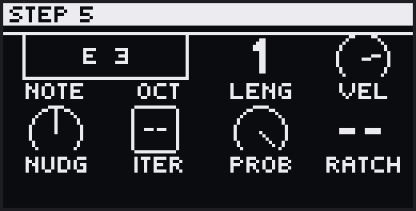

Holding a step redirects whatever knobs are on screen to that step. On the
**STEP** bank (the last clip bank on the jog, just before SOUND + CONFIG) the
knobs are the note's own settings, listed below; with no step held the bank reads
*Hold step to edit*. On a module editor, MACROS, or a MIDI-effect bank (NOTE FX,
HARMONY, DELAY, SEQ ARP, and CLIP's Dir), a held step makes the knobs write a
**lock** at that step (see [Automation](#11-automation)). LIVE ARP and the rest of
CLIP do nothing under a held step.

You never have to leave where you are to reach the note settings: **hold a step
that holds notes and turn the jog right** to reveal its STEP page over the current
screen, **turn left** (or let go) to return. A *JOG RIGHT / Edit step* card reminds
you as the hold begins; the footer says `JOG STEP` while a step is held, and
`JOG BACK` on the revealed page. An empty step has no step page.

Edits apply to every note in the step, and one hold is one undo. While holding
a step, tap a second step to set the note length up to it (gate-drag; tap the same
step again to shorten it by one); the arrows still page, so a note can be
stretched past the current page. Nudge a note past half a step and it moves to the
neighbouring step when you let go. **+ / −**
moves the octave range so you can reach higher or lower notes.

| Knob | On screen | Adjusts |
|---|---|---|
| 1 | `Note` | Pitch, by scale degree |
| 2 | `Oct` | Pitch, by octave |
| 3 | `Leng` | Note length (gate) |
| 4 | `Vel` | Velocity |
| 5 | `Nudg` | Timing, up to ±1 step |
| 6 | `Iter` | Iteration (below) |
| 7 | `Prob` | Probability (below) |
| 8 | `Ratch` | Ratchet (below) |

### Per-step conditions

Three settings decide *whether and how* a step fires. Each is off by default —
Iter and Ratch read `--`, Prob reads 100 %:

- **Iteration** (`Iter`) plays the step only on certain passes of the loop. `2:3`
  plays on the 2nd pass of every three. The counter resets on a cold start (Stop →
  Play).
- **Probability** (`Prob`) gives the step a chance of playing, from 100 % down to
  1 %. The roll is per note, so chords thin out unevenly.
- **Ratchet** (`Ratch`) retriggers the step 2, 3, or 4 times within its slot.

They stack in that order: iteration decides if the step plays, probability rolls
per note, and a note that plays fires all its ratchets.

## 6.4 Recording

Press **Record** to play notes into the active clip in real time.

| Transport | What happens |
|---|---|
| Stopped | A 1-bar count-in, then recording and playback start together |
| Playing | Records immediately, from wherever the playhead is |

While playing, Record is a punch: press to drop in, press again to drop out —
both take effect the moment you press. (A take that began with the count-in into
an empty clip stops at the end of the page; Record blinks until it does.) An empty
clip still sizes itself in whole pages as you record.

Recording adds to what's there; it never erases. For a clean take, clear the clip
first (**Delete + side button**), which also frees its length so the take sizes
itself to what you play. Notes played in the last half-beat of the count-in land
on step 1. You can switch tracks mid-take — recording follows the active track.

Recording runs in the **Forward** [playback direction](#91-clip-bank). A clip set
to another direction shows **REC UNAVAILABLE**: set its Dir to Fwd, or choose
**Bake Now**.

### Step recording

With the transport **stopped** on a melodic track, **Shift + Record** opens step
entry, classic hardware-sequencer style (drum and Conductor tracks don't have it).
The Record button turns white and one step blinks white — that's the cursor,
waiting for input, starting at the first step of the page you're viewing.

- **Play a pad** (or several together for a chord) — the notes land on the cursor
  step, and when you let go the cursor moves to the next step.
- **> with pads held** ties the note a step longer; each press extends it, and
  **< with pads held** takes one step back off.
- **> alone** is a rest — the cursor moves on, writing nothing.
- **<** steps back and **erases what you entered there this session** — your own
  correction key. Notes that were already in the clip stay.
- The cursor stops at the clip's last step; it never wraps.

Leave with **Shift + Record**, **Record**, **Back**, or just press **Play** to
hear it. One **undo** takes back the entire step-recording session in one go.

> Live Merge is unavailable while step entry is open — leave it first.

## 6.5 Capture

dAVEBOx is always listening. Everything you play on the pads while a track is not
recording is held in a buffer, so if you play something you want to keep, tap
**Capture** and it becomes real clip data. **Knob moves are held the same way** —
sweep a filter over a running loop, decide you liked it, and Capture writes it in
as [automation](#11-automation). The Capture button blinks white while there is
anything buffered to keep, notes or knob moves.

> **Like Move:** this is Move's Capture — play first, keep it after.

What Capture does depends on the transport:

| Transport | What Capture does |
|---|---|
| Playing | Adds the buffered notes to the active clip where you played them; knob moves become [automation](#11-automation). Into an **empty** clip, the take keeps the beat you played it on and starts on the next bar |
| Stopped, empty set | Reads a tempo from your playing, sizes a clip to whole bars, and starts it |
| Stopped, focused clip empty | Fits the take to the current tempo; the *Fit to bars* screen lets the jog pick how many bars it fills (**Shift + jog** fine-stretches it) |
| Stopped, focused clip holds notes | Session View opens — tap a blinking empty clip on that track to keep the take (**Record** cancels) |

After a stopped capture into an empty set, a tempo chooser offers the detected BPM
and a few nearby candidates over a strip showing your take against the bars —
playback keeps rolling as you scroll them, so you can hear which one fits. Capture
works on drum clips too, and one **Undo** takes back any capture. To clear the buffer,
hold **Shift** and tap **Capture** — that drops held knob moves as well as held notes.

**What the buffer holds.** Capture keeps what you *just* played, not everything
since you started:

- it reaches back **8 bars** at most;
- playing over a spot you already played on an earlier lap of the loop replaces
  that earlier lap, so four passes of jamming keep the last one;
- selecting another track, editing a clip by hand (entering steps, clearing),
  launching a clip or scene, arming Record, starting or stopping the transport, or
  a pause of about two bars starts it afresh;
- every Capture tap empties it, even one that found nothing to keep.

**Capturing knob moves.** Any parameter you turn while the loop is running and
Record is **off** is kept, and one Capture tap commits every one of them at once,
into the clip you heard them in. A captured sweep lands as a smooth lane you can
edit like any other automation, and it undoes in one press. Because it is about
what you just heard, the buffer only fills while the transport runs, going round
the loop again replaces what the last lap kept, and stopping clears it.

## 6.6 Clip length & the loop

A clip runs up to **256 steps**, shown as **pages** of 16. **Left / Right** moves
between the pages inside the loop (and turns Seq Follow off), and **Loop + jog**
changes the clip length by a step.

Hold **Loop** for the **loop view**, where the step buttons stand for pages — a
page inside the loop lights in the track color (pulsing if it holds notes). While
Loop is held:

| Gesture | Sets the loop to |
|---|---|
| Jog ±1 | Grow or shrink from the end |
| Tap a page | End the loop on that page (from page 1, or from the loop's start if it starts later) |
| Hold one page, tap another | The range between them |

Notes outside the loop are kept and return when you widen it.

## 6.7 Undo

**Undo** reverses the last edit; **Shift + Undo** redoes it. Undo is one step deep. It covers step and
clip edits, copy and clear, recording, bakes, and more.

---

# 7. Drum Clips

On a drum track, each sound is a **lane** — its own step sequence with its own
length, timing, and effects. A track has **32 lanes**, each mapped to a MIDI note
that triggers one sound in the instrument.

The pad grid splits in two:

| Half | Holds |
|---|---|
| **Left 4×4** | 16 drum lanes. Tap one to hear its sound and select it — the steps then show that lane. |
| **Right 4×4** | Velocity zones, or a [note-repeat](#73-note-repeat) mode |

The left pads show 16 lanes at a time; **+ / −** switches between lane **bank
A** and **bank B** for all 32. The screen shows the active bank.

## 7.1 Placing hits

Select a lane, then tap **steps 1–16** to add or clear its hits. The steps always
show the selected lane.

**Velocity zones** (the right 4×4) set the velocity for the hits you place next —
16 zones from 8 (bottom-left) to 127 (top-right). A zone pad also plays the selected
lane at that velocity; with a step held it sets that hit's velocity, or places the
hit if the step was empty.

**A lane's sound** is set by its MIDI note, on the [NOTE FX bank](#101-note-fx):
knob 1 moves it by an octave, knob 2 by a semitone. The screen shows the note,
e.g. `Pad: C1 (36)`.

Editing a hit works the same as [note edit](#63-editing-notes), minus the pitch
knobs: Leng, Vel and Nudg on knobs 1–3, Iter, Prob and Ratch on 5–7.

## 7.2 Per-lane loops

Each lane has its own loop length, set with **Loop + jog** on the selected lane.
On the ALL LANES bank, Loop + jog and the loop-page gestures set every lane at once.
A kick looping over 16 steps, a hat over 12, and a percussion lane over 10 each
cycle against the shared transport — a polyrhythm from one clip.

## 7.3 Note Repeat

Note Repeat retriggers a lane at a steady rate. **Shift + Step 8** cycles the right
pads between velocity zones and the two repeat modes; entering a repeat mode shows
which one and puts the track on its RPT GROOVE bank.

The bottom two rows of the right pads are **rates**; the top two rows are a **gate
mask**:

```
   top row      [ gate 5 ][ gate 6 ][ gate 7 ][ gate 8 ]   gate mask
                [ gate 1 ][ gate 2 ][ gate 3 ][ gate 4 ]   (8-step loop)
                [ 1/32T  ][ 1/16T  ][ 1/8T   ][ 1/4T   ]   triplet rates
   bottom row   [ 1/32   ][ 1/16   ][ 1/8    ][ 1/4    ]   straight rates
```

- **Rpt1** repeats the **selected** lane: hold a rate pad. Velocity follows pad
  pressure, and you can change lanes while holding.
- **Rpt2** repeats **any** lane at a rate you assign it: tap a rate pad to assign
  it to the selected lane, then hold a lane pad. Hold several for layered repeats.

**Latch** keeps a repeat going after you let go: **Loop + rate pad** (Rpt1) or
**Loop + lane pad** (Rpt2) — or press Loop while already holding one. Tap a latched
pad again to release it. Tapping **Loop** with no pads held releases all latches on
the track; **Delete + Loop** stops them too. Latched lanes light cyan,
and stopping the transport clears them.

**The gate mask** (top two rows) is a looping on/off pattern over the repeats — all
on by default, tap to toggle. **Loop + a gate pad** sets its cycle length (1–8) and
turns every gate in it back on; gates past the cycle show dark grey. **Delete + a
gate pad** resets that step's groove. Per-step velocity and timing for the mask
live in the [RPT GROOVE bank](#rpt-groove).

## 7.4 Copying, clearing & muting lanes

- **Copy + lane pad**, then tap another lane to paste (the destination keeps its
  own MIDI note). **Shift + Copy** cuts.
- **Mute + lane pad** mutes a lane; **Shift + Mute + lane pad** solos it (the two
  cancel each other). **Delete + Mute** clears the track's lane mutes and solos.
- **Delete + lane pad** clears the lane's hits (*LANE CLEARED*).
- **Shift + Delete + lane pad** resets the lane — hits, length, loop, effects and
  repeat groove — but keeps its sound (*LANE RESET*).

---

# 8. The Conductor

A **Conductor** is a track that transposes every playing melodic clip up or down
in real time, following the note it plays. It sends no MIDI of its own — its
sequence (and its live pads) only steer the transposition. The written notes on
the other tracks never change; the shift is live and reversible. **A project can
hold one Conductor at a time.**

This lets one track lead a key change or chord move across the whole arrangement:
sequence a progression on the Conductor, and every responding track follows it.

## 8.1 Creating one

**Shift + click** the track's **Instmt/Dest** row — the top row of its TRACK CONFIG
menu — and choose **Conductor**, which sits just after the Move instruments. The
transport must be stopped, and it asks first (*Make Conductor?*). Its notes carry
over; its effects, arps, and automation reset. If another track is already the
Conductor, the screen says which one — route it back first.

**Mute** pauses its conducting — the responders snap back to their written pitch.

A Conductor plays nothing, so its TRACK CONFIG menu is short: the Instmt/Dest row and
the track's own settings, with no FX slots, mixer controls, LFOs or presets. None
of that is lost — whatever instrument the track had is **parked**, and it comes
back with everything attached when you choose an instrument again from that same
picker. That is also how you turn a Conductor back into an ordinary track.

## 8.2 How the shift works

Zero transposition is the **session root at octave 4** — the default pad note. Play
that and nothing shifts; play higher and the responders rise, lower and they fall.
The Conductor's own octave scales the move, so an octave up on the Conductor is an
octave of transposition.

The shift follows the global **Scale Aware** setting — by scale degree (staying in
key) when it's on, by semitone when it's off. Between Conductor notes the
responders return to zero — unless **Cond Lock** is on (below). A muted Conductor
always holds them at zero. Drum tracks never respond.

## 8.3 The Conductor's banks

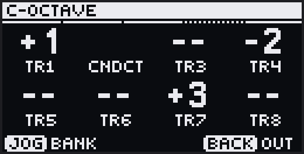

A Conductor's jog walks six banks, each headed with a **`C-`** so you always know
you're on the Conductor. RESPONDER, OCTAVE, WHEN and Cond Lock belong to the
Conductor's current clip, so different Conductor clips can steer different tracks:

| Bank | Controls |
|---|---|
| **Conduct** | The CLIP bank's timing and direction, with **Cond Lock** (`CDLK`) on knob 6: *Off* holds the shift only for each note's length; *Lock* holds it until the next Conductor note. |
| **NoteFX** | Shapes the Conductor's note before the shift is worked out — an octave, an offset, and a per-note random amount. Knobs 3–6 show `-`. |
| **Responder** | An on/off cell per track (`TR1…TR8`) — on (the default) means the track follows. A drum track's cell is empty; the Conductor's own reads `CNDCT`. |
| **Octave** | A per-track octave (**−4…+4**) added on top of the shift while the Conductor sounds. |
| **When** | Per track: **Next** (a responder takes the shift at its next note) or **Now** (a sounding note is retriggered at the new pitch at once). |
| **Step** | Edits the held step, as on any track. |

## 8.4 Making it permanent

The Conductor's transposition can be folded into the responding clips when you
[bake a scene](#161-bake) or [export to Live](#163-export-to-live), each offering
an **Apply Conductor?** step. The Conductor track itself has no bake and exports as
a silent placeholder.

---

# 9. Clip Timing & Grid

These banks set a clip's grid, timing, and playback — **CLIP** on a melodic track,
**DRUM LANE** and **ALL LANES** on a drum track. Some parameters permanently
rewrite your notes (the **Rewrites notes** column marks which; **Undo** reverses
those); the rest only change how the clip plays.

**Resetting a bank** (this works on any bank, including [Effects](#10-effects)):

| Gesture | Result |
|---|---|
| **Delete + jog click** | Reset every parameter in the active bank (not ALL LANES, STEP, or the Conductor's RESPONDER, OCTAVE and WHEN). One-shot actions (Stretch, Shift, Legato) hold no value, so they are left alone. On a drum track while Note Repeat is on, it resets the selected lane's groove instead |
| **Delete + jog click** on **MACROS** | Unassign all eight macros on the track. **Asks first** — jog to choose, click to answer. Values and automation are left alone |
| **Shift + Delete + jog click** | Reset the whole MIDI effect chain — NOTE FX, HARMONY, DELAY and SEQ ARP |
| **Shift + Delete + side button** | Reset the whole clip — notes and all parameters |

**Resets are undoable.** **Undo** takes back a bank reset on any bank, and a macro
clear; **Shift + Undo** re-applies it. Undo is one step deep.

**Resetting a parameter also clears its automation.** Automation follows the
thing it automates: reset a bank and the [automation](#11-automation) recorded for
*that bank's* parameters goes with it, while every other lane is left alone.
Clearing a sequence or resetting a clip clears that clip's automation entirely.
Undo restores the notes and the automation together, as one step.

The two gestures differ in **reach**, not in depth. Delete + jog click is about
the one bank in front of you. Shift + Delete + jog click is about the sequencer's
**MIDI effect chain** — it puts NOTE FX, HARMONY, DELAY and SEQ ARP back to
their defaults together, and deliberately leaves everything that defines the clip
itself alone: the CLIP bank, drum lane and ALL LANES settings, and **STEP**, which
is your notes. It also leaves the Macros, Sound and Automation banks untouched,
because those can change how the track *sounds*, not just what it plays.

⚠ **LIVE ARP cannot be automated.** Its settings belong to the track rather than to
one clip, so a recorded lane could only ever be right for the clip you happened to
be on. It is still available as a macro destination, and Delete + jog click on the
LIVE ARP bank resets it.

On a drum track, clearing a single **lane** leaves automation alone — a drum
clip's automation covers the whole clip, so removing it would take moves
belonging to the lanes you kept.

## 9.1 CLIP bank

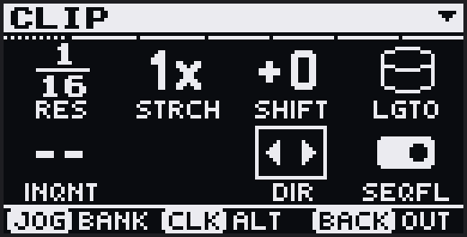

A melodic clip's grid, direction, and note transforms.

| Knob | On screen | What it does | Rewrites notes | Default |
|---|---|---|---|---|
| 1 | `RES` | **Resolution** — keeps the pattern's steps and changes how long a step is. *Alt* (`ZOOM`): keeps the timing and changes how many steps it takes. | Yes | 1/16 |
| 2 | `STRCH` | **Stretch** — turn right to double the clip, left to halve it; one change per touch (let go to do it again). Refused (*COMPRESS LIMIT*) when notes would collide. | Yes | — |
| 3 | `SHIFT` | **Shift** — rotate all notes by whole steps. *Alt* (`NUDGE`): finer. | Yes | 0 |
| 4 | `LGTO` | **Legato** — touch the knob and click the jog; lengthens every note to reach the next. Turning it does nothing. | Yes | — |
| 5 | `INQNT` | **Input Quantize** — snap recorded notes to the grid (Off, 1/64 … 1/4t). One value per track, shared with ALL LANES. | No | Off |
| 7 | `DIR` | **Direction** — Forward, Backward, or ping-pong. *Alt* (`REVRS`): **Reverse Style**. | No | Fwd |
| 8 | `SEQFL` | **Follow** — scroll the step display to keep up with the playhead. | No | On |

**Direction** plays the clip Forward, Backward, or bouncing between the two (the
two ping-pong modes differ only in which end they start from). **Reverse Style**
(the alt of `Dir`) sets what backward playback does to each note:

- **Step** (default) reverses the *order* of the steps — each note still triggers
  at its start, so the pattern runs back-to-front but the notes sound unchanged.
- **Audio** also mirrors each note within its slot: on a backward pass the note-on
  lands at the note's end and the note-off at its start, for a tape-reverse feel.
  (In ping-pong, Audio plays the endpoints twice, so every note gets one forward
  and one reversed pass.)

Recording needs **Forward** direction; [bake](#161-bake) and
[export](#163-export-to-live) freeze the direction into the notes and reset it to
Forward.

## 9.2 DRUM LANE bank

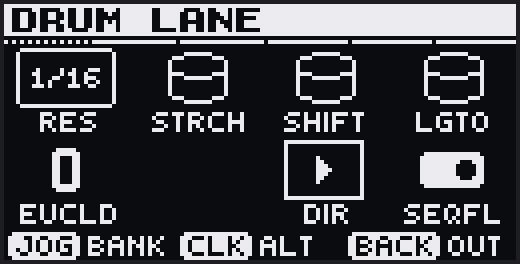

The **selected lane's** grid — the drum counterpart to the CLIP bank.

| Knob | On screen | What it does | Rewrites notes | Default |
|---|---|---|---|---|
| 1 | `RES` | **Resolution.** *Alt:* `ZOOM`. | Yes | 1/16 |
| 2 | `STRCH` | **Stretch.** | Yes | — |
| 3 | `SHIFT` | **Shift.** *Alt:* `NUDGE`. | Yes | 0 |
| 4 | `LGTO` | **Legato** (this lane) — touch the knob and click the jog. | Yes | — |
| 5 | `EUCLD` | **Euclid** — spread N hits evenly across the lane. Hand-placed hits stay. | Yes | 0 |
| 7 | `DIR` | **Direction.** *Alt* (`REVRS`): **Reverse Style.** | No | Fwd |
| 8 | `SEQFL` | **Follow.** | No | On |

Lane length is **Loop + jog**; the lane's MIDI note is on the
[NOTE FX bank](#101-note-fx).

## 9.3 ALL LANES bank

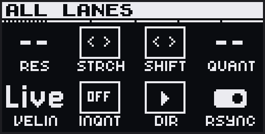

Applies one setting to **all 32 lanes** at once. Because that rewrites every lane,
the bank opens on a **"Edits will affect all lanes. Proceed?"** screen — **click
the jog (or press OK) to confirm** before the knobs, Loop, or the Shift + Step
shortcuts do anything. Back re-arms the question.

| Knob | On screen | What it does | Rewrites notes |
|---|---|---|---|
| 1 | `RES` | **Resolution** for all lanes | Yes |
| 2 | `STRCH` | **Stretch** all lanes (`NO ROOM` if any can't fit) | Yes |
| 3 | `SHIFT` | **Shift.** *Alt:* `NUDGE`. | Yes |
| 4 | `QUANT` | **Quantize** all lanes at playback | No |
| 5 | `VELIN` | Velocity input override for the track (Live, 1–127) | No |
| 6 | `INQNT` | Recording input quantize for the track | No |
| 7 | `DIR` | **Direction** for all lanes. *Alt* (`REVRS`): **Reverse Style.** | No |
| 8 | `RSYNC` | **Repeat Sync** — held repeats wait for the beat grid (On) or fire at once (Off) | No |

---

# 10. Effects

Two kinds of processing shape notes beyond the stored clip:

- **Effects** (§10.1–10.4) reshape every note — sequenced or live — at playback, per
  clip. They are non-destructive: return a knob to its default and the clip plays
  exactly as written.
- **Live input modifiers** ([§10.5](#105-live-input-modifiers)) act only on what you
  play live, before it is sequenced. LIVE ARP is the melodic one; on drums it is
  [Note Repeat](#73-note-repeat), shaped by RPT GROOVE.

Drum tracks have NOTE FX and DELAY only. With a bank card showing, a jog click
toggles its *Alt* page (the arrow in the header flashes).

Everything runs the same chain — the live modifier at the front, the effects after:

```
 LIVE INPUT ──▶ [LIVE ARP / Note Repeat] ──┐
                                           ├─▶ NOTE FX ─▶ HARMONY ─▶ DELAY ─▶ SEQ ARP ─▶ OUT
 SEQUENCED NOTES ──────────────────────────┘
```

Global [swing](#171-project-settings) is applied after the chain;
[Performance Mode](#13-performance-mode) comes last.

## 10.1 NOTE FX

*Melodic & drum.*

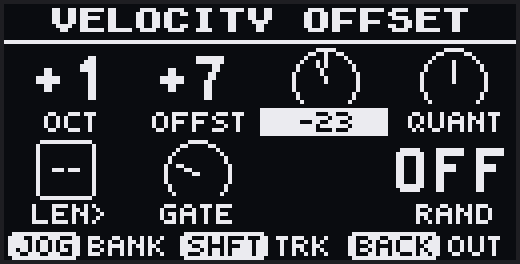

Shifts every note's pitch, velocity, timing, and length.

| Knob | On screen | What it does | Default |
|---|---|---|---|
| 1 | `OCT` | Octave shift (±4) | 0 |
| 2 | `OFFST` | Note offset — scale degrees or semitones (±24) | 0 |
| 3 | `VEL` | Velocity offset (±127) | 0 |
| 4 | `QUANT` | Quantize at playback (0–100 %) | 0 % |
| 5 | `LEN>` | Fixed note length in step-multiples (`--` = as written) | -- |
| 6 | `GATE` | Scale the length, 0–400 % — under 100 % shortens, over 100 % lengthens | 100 % |
| 8 | `RAND` | Pitch randomness (0–24; `--` at 0). *Alt* (`ALGO`): **Pure** (even spread), **Gaus** (clusters near the note) or **Walk** (drifts from note to note) | -- |

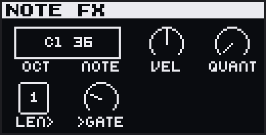

On a **drum track**, knobs 1 and 2 (`OCT`, `NOTE`) set the selected lane's MIDI
note; knobs 3–6 apply to that lane, and 7–8 are empty.

## 10.2 HARMONY

*Melodic.*

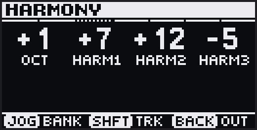

Adds up to four voices to every note: an octave voice (`OCT`, ±4 octaves) and three
harmony intervals (`HARM1`–`HARM3`, ±24 — scale degrees with Scale Aware on,
semitones with it off). Negative values add the voice below. 0 = off.

## 10.3 DELAY

*Melodic & drum.*

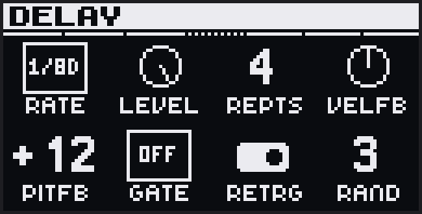

Echoes every note in rhythm.

| Knob | On screen | What it does | Default |
|---|---|---|---|
| 1 | `RATE` | Delay time (dotted and triplet values included). *Alt* (`CLKFB`, ±100): each echo comes sooner (−) or later (+) than the last, like a bouncing ball | 1/8D |
| 2 | `LEVEL` | Echo velocity | 127 |
| 3 | `REPTS` | Number of echoes (0 = off) | 0 |
| 4 | `VELFB` | Velocity change per repeat | 0 |
| 5 | `PITFB` | Pitch change per repeat (scale-aware) | 0 |
| 6 | `GATE` | Fixed echo length (Off = natural) | Off |
| 7 | `RETRG` | A new note clears the echoes in flight | On |
| 8 | `RAND` | Pitch randomness on echoes. *Alt* (`ALGO`): Pure, Gaus or Walk | 0 |

On a drum track DELAY has no pitch controls: knobs 5–7 are Gate, Clock Feedback and
Retrigger.

## 10.4 SEQ ARP

*Melodic. Per clip.*

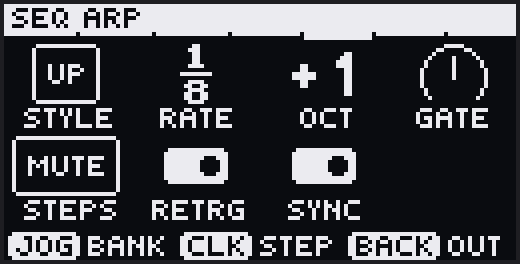

An arpeggiator running after Delay, on both sequenced and live notes.

| Knob | On screen | What it does | Default |
|---|---|---|---|
| 1 | `STYLE` | Style — Up, Down, Up/Down, Converge, Diverge, Ordered, Random, and more | Off |
| 2 | `RATE` | Arp rate | 1/16 |
| 3 | `OCT` | Octave range (±4) — the extra octaves join the notes the style orders (Down +1 plays from the top octave down); negative extends downward | Off |
| 4 | `GATE` | Note length (under 100 % shortens, over lengthens) | 100 % |
| 5 | `STEPS` | How silenced steps behave — rest (`Mute`) or skip (`Step`) | Mute |
| 6 | `RETRG` | Restart the arp on each new note | On |
| 7 | `SYNC` | Wait for the next rate boundary | On |

**Click the jog** for the per-step editor (on LIVE ARP too): knobs 1–8 set each
step's pitch offset (±24 scale degrees), and with **Shift** held they set each
step's velocity (`Thru` passes the incoming velocity). On the pads, the column is the
step and the row one of four velocity levels, bottom to top; press the bottom row
again to turn the step off, and **Delete + pad** sets `Thru`. **Loop + pad** sets
the step-loop length (1–8). Turn the jog to close the editor.

## 10.5 Live input modifiers

These shape what you play **live** — on the pads or over external MIDI — before it
is sequenced. They leave the stored clip untouched, and are a different stage from
the effects above.

### LIVE ARP

*Melodic. Per track.*

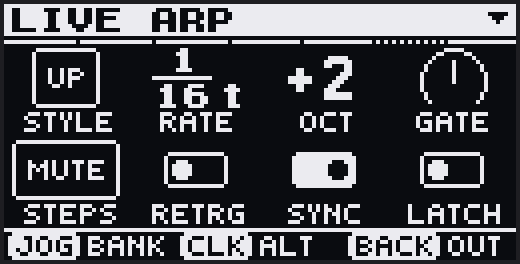

An arpeggiator for live pad and external input; it leaves sequenced notes alone.
The controls match [SEQ ARP](#104-seq-arp) (except Retrigger defaults to Off), plus
**Latch** (`LATCH`, knob 8), which keeps the arp running after you release. With
pads held, tap **Loop** to latch, and tap it again (pads held) to unlatch. Loop with
no pads held clears the latched notes but keeps Latch on. Stop, **Delete + Play**,
or switching to Session View unlatches. **Shift + Step 11** toggles LIVE ARP on and
off with the last style.

### RPT GROOVE

*Drum. Per lane.*

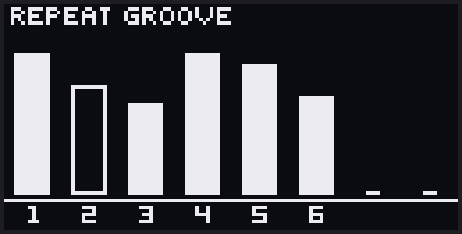

**Repeat Groove** shapes the 8-step gate mask of a lane's
[Note Repeat](#73-note-repeat); you hear it while a repeat mode is active.

| Knobs | Screen page | After jog-click |
|---|---|---|
| 1–8 | **Velocity** per gate step — `Thru` (the pad's own velocity) or a value 1–127 | **Nudge** per gate step (±50 % of the step) |

**Delete + jog click**, while a repeat mode is on, resets the selected lane's groove.

---

# 11. Automation

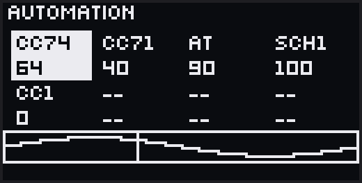

**Anything you can turn, you can automate.** Automation in dAVEBOx is per
*parameter*, not per lane: a synth or effect parameter, a level, one of the
bank knobs, or a MIDI target. There is no separate lane to arm and no separate
place to draw — the knob that plays the parameter is the knob that records it.

## 11.1 Making it

Two ways, both covered where the knobs are:

- **Record it.** With the transport playing and Record armed, turn a knob and
  the move is written at the playhead for as long as your hand is on the knob —
  round the loop as many times as you hold it.
  Parameters you don't touch keep what they had. See
  [Recording](#64-recording).
- **Lock a step.** Hold a step and turn a knob and that step takes a **lock** —
  a value the parameter jumps to when the step plays. See
  [Editing notes](#63-editing-notes).

A value **holds until the next one** — and round the loop: the last value in a
clip carries through its first steps until the first lock or recorded move
comes round. A recorded (smooth) move glides from its last value back to its
first across the loop point.

Which knobs? The ones on the module editor's pages, the levels on
**SOUND + CONFIG** and in the session mixer, the eight **MACROS**, and dAVEBOx's own
bank knobs — CLIP and ALL LANES direction, NOTE FX (all but `LEN>`), HARMONY,
DELAY, and SEQ ARP (all but `STEPS`). See
[Parameter banks](#35-parameter-banks) and [Effects](#10-effects).

An automated knob says so where it lives: a dot on its cell, and a blinking
ring. **Mute + touch** mutes that parameter's automation; **Delete + touch**
clears it. (In the session mixer, Mute + touch still mutes the track.)

Without Record, turning an automated knob while playing takes it over until you let
go; while stopped, it sets the value the parameter rests at.

**Switching clips hands the parameter over.** Leave a clip and its automated
parameters go back to where they rest, so an empty clip doesn't inherit the
last clip's sound. Arrive in a clip that automates the same parameter and it
lands on *that* clip's resting value straight away, rather than holding the
old one until its first move comes round. A parameter whose automation you
muted is left where your hand put it.

## 11.2 The AUTOMATION bank

**AUTOMATION** is the last bank on the jog: the **list of everything automated
in the current clip** — parameters, levels, MIDI targets, and the pads'
aftertouch — each with its state (ON, OFF, or SMTH). Its knobs do nothing; the
jog is the whole surface.

**Click the jog** for the menu. As the cursor moves onto a row, the **step
buttons blink white** on every step where that parameter has a value set — its
step locks, and any step a recorded move passes through. **Shift + click** a row
to jump to where that parameter is edited — its bank, its module's page, SOUND +
CONFIG for a level, or MACROS for a MIDI target — and **Back** from there
returns you to this menu, on the same row. Click a row for
its operations:
**Delete**, **Mute** / **Unmute**, **Mode** (*Curve* plays the lane as a continuous
envelope; *Punch* makes each lock last just its own step, with the parameter back at
rest on every other step — Smooth and Wrap don't apply there and are hidden),
**Smooth** (*On* glides between values, *Off*
steps — on parameters that can ramp), **Wrap** (*Carry* keeps the last value going
round the loop; *Reset* returns the parameter to where the knob sits at rest, until
the first lock or recorded move comes round), **Link** (*On*, the default: the
parameter's automation is transformed with the note sequence — Resolution and
Beat Stretch scale it, Clock Shift and Nudge move it, doubling the loop copies
it forward; on a drum track, the ALL LANES versions of those. *Off*: it stays
where it is whatever you do to the notes), **Loop** (that parameter's own loop length in steps, or CLIP to
follow the clip), **Rate** (/16 to ×16, the loop stretching to match) and **Scale**
(0–200 %: the whole lane's moves made smaller or bigger). The last row is **Clear
all**, and **Delete + click** on the card does the same. With nothing automated the
bank reads *NO AUTOMATION*; the pads' aftertouch row reads PADS and offers Delete
only.
Every operation is one undo, and **Back** closes one layer at a time. Conductor
tracks don't have this bank. On a **drum track**, automation runs the length of
the **longest lane**; shorter lanes loop inside it.

## 11.3 MIDI targets

A macro can point at **Aftertouch** or **Pitch Bend** on any track, and at any
**MIDI CC** on a MIDI track. They record, lock, mute and clear like any other
parameter and appear in the AUTOMATION list by name — see
[the MACROS bank](#146-the-macros-bank). Aftertouch played from the pads is
recorded on its own and shows in the list as its own row.

---

# 12. Arranging

Arranging happens in **Session View** — the clip grid on the pads, 8 tracks across
and 4 rows visible. **+** and **−** scroll the window one row at a time through all
16 rows. The eight knobs are a mixer, one per track, and the jog picks what they
set (Volume, Pan, Send A, Send B).

## 12.1 Launching clips

| Gesture | Result |
|---|---|
| Tap a clip | Launch it (or queue it for the next boundary) |
| Tap the playing clip | Stop it at the end of its page (tap again to cancel) |
| Tap a queued clip | Cancel the launch |
| Tap an empty clip | Switch the track to it — the track goes quiet, and recording lands there |
| **Shift + clip** | Open it in Track View. While stopped, a clip with notes opens without launching; an empty clip launches. |
| **Copy + clip**, then another | Copy the clip (**Shift + Copy** cuts) |
| **Delete + clip** | Clear its notes (it keeps playing) |
| **Shift + Delete + clip** | Reset the clip completely |

Launching a clip replaces whatever was playing **on that track**. Switching to a
track launches its focused clip only if that clip is empty, so you can move between
tracks without triggering the ones that hold notes. Keep holding **Copy** to paste
the same clip into several slots; letting go of Copy empties the clipboard.

## 12.2 Scenes

A scene launches one clip from every track at once — tap a **scene launcher** (left
of the grid) or a **step button (1–16)**. **Shift + scene launcher** launches at
the next bar. Launching a scene switches **every** track to that row, so a track
whose clip there is empty falls silent.

| Gesture | Result |
|---|---|
| **Copy + scene launcher**, then a row | Copy all 8 clips |
| **Shift + Copy + scene launcher** | Cut the row |
| **Capture + scene launcher** | Snapshot the playing clips into the row |
| **Delete + scene launcher** | Clear the row's notes |
| **Shift + Delete + scene launcher** | Reset the row's clips |

## 12.3 Mute & solo

In Session View each knob stands for its track:

| Gesture | Result |
|---|---|
| **Mute + touch knob 1–8** | Mute that track |
| **Shift + Mute + touch knob** | Solo it |
| **Delete + Mute** | Clear every mute and solo |

A muted track goes silent, but a live pad you hold still plays through. The knob
LEDs show each track's state: its color when playing, dark when muted, blinking
when soloed. (Mute the
active track directly in [Track View](#52-muting-the-track); mute a drum lane in
[Drum Clips](#74-copying-clearing--muting-lanes).)

## 12.4 Mute snapshots

Store up to **16 mute/solo states.** In Session View, hold **Mute** and the step
buttons light (grey = empty, yellow = saved):

| Gesture | Result |
|---|---|
| **Mute + Shift + step** | Save the current mute/solo state |
| **Mute + step** | Recall it |
| **Mute + Delete + step** | Clear that slot |

For snapshots of the sound itself, see
[Sound snapshots](#147-sound-snapshots--snapmorph).

Snapshots persist across reboots.

## 12.5 Volume

The **Volume** knob controls Move's master output, everywhere. **Shift +
Volume** adjusts the **active track's** volume — also everywhere: Track View,
Session View, and inside the sound editor. A chain track's level and a
Move track's mixer level are the same values the mixer rows show, and they are
saved with the project. A MIDI track sends standard
**MIDI volume (CC 7)** on its channel out the USB port (a `MIDI to Track`
follower has no output of its own and says so).

---

# 13. Performance Mode

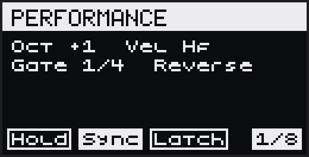

Performance Mode grabs a short loop of what's playing and lets you transform it
live from a grid of effects. It runs in **Session View**.

## 13.1 Entering and exiting

**Tap Loop** to turn it on and keep it on hands-free; **hold Loop** to use it only
while held. Tap **Loop**, **Back** or **Note/Session** to leave; leaving keeps your mod
state. **Shift + Loop** toggles Latch. The screen shows the recalled preset's name,
or *NO MODS ENGAGED*.

## 13.2 The grid

```
   top row      wild mods        — blue
                velocity / gate  — yellow
                pitch mods       — magenta (melodic only)
   bottom row   length · hold · sync · latch
```

The **bottom row** sets the capture length and mode:

| Pad | Sets |
|---|---|
| 1–5 | Capture length: 1/32, 1/16, 1/8, 1/4, 1/2 bar |
| 6 | **Hold** — keep the loop while you hold this pad |
| 7 | **Sync** — clock-aligned capture |
| 8 | **Latch** — sticky mods |

Sync and Latch start on. **Shift + a length pad** keeps that length looping after
you let go; lengths stack, and **Hold** clears them.

The three **mod rows** transform the loop. With **Latch** on, tapping a mod pad
toggles it and it stays on until you tap it again; with Latch off, a mod runs only
while you hold its pad. Press a lit pad to turn its mod off.

<details>
<summary><b>Pitch mods</b> (magenta, melodic only)</summary>

| Pad | Name | Effect |
|---|---|---|
| 1 | Oct Up | Alternates octave up / original |
| 2 | Oct Down | Alternates octave down / original |
| 3 | Scale Up | +1/+2/+3 scale degrees over 3 loops, then resets |
| 4 | Scale Down | −1/−2/−3 over 3 loops |
| 5 | Fifth | Up 4, 8, then 12 scale degrees (stacked fifths), then resets |
| 6 | Tritone | Up 3, 6, then 9 scale degrees over 3 loops, then resets |
| 7 | Drift | ±1 random walk, drifts to ±6 |
| 8 | Storm | Random ±6 scale degrees per note — chaotic, in key |

</details>

<details>
<summary><b>Velocity / gate mods</b> (yellow, all tracks)</summary>

| Pad | Name | Effect |
|---|---|---|
| 1 | Decrescendo | −15 % velocity each loop, down to 10 % |
| 2 | Swell | 16-loop triangle |
| 3 | Crescendo | +15 % velocity each loop, up to full |
| 4 | Pulse | Even loops full, odd loops 20 % |
| 5 | Sidechain | −15 % per successive note in a loop |
| 6 | Staccato | Gates to 1/8 of the loop |
| 7 | Legato | Gates to the full loop |
| 8 | Ramp Gate | Gate ramps up across notes |

</details>

<details>
<summary><b>Wild mods</b> (blue)</summary>

| Pad | Name | Effect |
|---|---|---|
| 1 | Half Time | Every other loop dropped |
| 2 | 3 Skip | Every third loop dropped |
| 3 | Phantom | Ghost note an octave below, ¼ velocity |
| 4 | Sparse | ~50 % of notes dropped |
| 5 | Glitch | ±2 scale-degree shift per note |
| 6 | Stagger | Notes offset +0, +1, +2… scale degrees |
| 7 | Shuffle | Pitch/hit order shuffled each loop |
| 8 | Backwards | Pitch/hit order reversed each loop |

</details>

## 13.3 Which tracks it captures

A track feeds Performance Mode when its **Looper** setting is on
([Track settings](#174-track-settings)). While Performance Mode is locked, touch a
knob to toggle its track's Looper — the knob LED is the track color when on.

## 13.4 Presets

The **step buttons are 16 preset slots**: press one to recall it (again to turn it
off), **Shift + step** to save, **Delete + step** to clear. The step LEDs are white
for the recalled slot, blue for saved and grey for empty. Slots 1–8 ship with
combinations (Float, Sink, Heartbeat, Fairy Dust, Robot, Dissolve, Chaos, Lift):
you can save over them for the session, but they return to the factory set at the
next launch. Slots 9–16 are yours and are saved with the project.

---

# 14. Sound & Track Config

Each track's sound — its instrument, its effects, its levels, and the knobs that
play them — is set from the track's own menu, **TRACK CONFIG**. Playback carries
on while you work in it, and the pads and step buttons stay with the sequencer, so
you can keep playing while you dial.

## 14.1 Opening TRACK CONFIG

The way in is the **SOUND + CONFIG** bank, which comes after STEP on the jog. It is
a door rather than a screen: its knobs are the track's levels (**Volume, Pan,
Send A, Send B** on knobs 1–4), and its bottom row reads *CLICK TO ENTER / TRACK 3
CONFIG*. On a MIDI track the knobs are that track's controllers instead —
Expression, Pan, Mod, Sustain, Program, Bank MSB and Bank LSB.

| Gesture | Result |
|---|---|
| **Click the jog** on SOUND + CONFIG | Open TRACK CONFIG |
| **Shift + Note/Session** (Track View) | Open it from anywhere — from deep inside it, back to its top in one press |
| **Shift + hold Note/Session** (Track View) | Go straight to the track's instrument |
| **Back** | Step out one level; from the top, back to the SOUND + CONFIG card |
| **Note/Session** | Return to the track overview; coming back brings the screen with it |

Once open, the menu **stays up until you leave it**. In Session View the same
Shift + Note/Session gesture opens the Master & Send FX list instead (see
[Master FX and the sends](#148-master-fx-and-the-sends)).

While you're on the menu — anywhere outside a module's own pages — knobs 1–4 stay
the track's levels, so you can balance the sound while you navigate it.

> **Every list looks the same.** Track Config and its sub-screens, Project
> Settings and the project screens share one layout: a filled title bar, the
> selected row filled white, a scrollbar when there's more than fits. A `>` at the
> right of a row means it opens something; a value means the jog changes it, shown
> in [brackets] while you're changing it.

Deeper screens open as **overlays** — a box over the screen you came from, with a
breadcrumb naming where you are (`T3 > Macros > Knobs`). A setting with more than
two choices opens a **list to pick from**; backing out of a list leaves the
setting as it was. The track's own settings at the foot of the menu are the
exception: a click hands the setting to the jog and you turn through its values.

## 14.2 The menu

The rows run top to bottom in groups, with a line between them. A track shows only
the rows it has:

| Row | What it does |
|---|---|
| **Instmt/Dest** | What the track plays — see [Choosing an instrument](#143-choosing-an-instrument). **Click** to edit it, **Shift + click** to change it. |
| **MIDI FX** | A MIDI effect in front of the instrument |
| **FX 1–4** | Four insert effects after it. Click an **empty** one to pick an effect. On a Move track these are the track's Move FX bus. |
| **Volume, Pan, Send A, Send B** | The track's levels. **Shift + click** a send to land in that send's own effects; **Back** brings you home. |
| **Buses** | Voice groups, on instruments that can split their voices — see [Presets, LFOs and buses](#145-presets-lfos-and-buses) |
| **LFOs** | Two LFOs for the track |
| **Presets** | Save and load the whole chain |
| **Import MIDI** | Bring a MIDI file into a clip — see [Import a MIDI file](#164-import-a-midi-file) |
| **Mode, Layout, Transpose, VelIn, Looper, AftTch, Parallel** | The track's own settings — see [Track settings](#174-track-settings) |

On the Instmt/Dest and effect rows a hint band pops over the foot of the menu
saying what the click and the Shift chord do.

**Swapping and reordering effects.** **Shift + click** an effect row to open its
module list, with the loaded module in [brackets]. Pick another to swap it. Indented
under it sit **<Move up** and **>Move down**, which swap the effect with its
neighbour (each appears only toward a block that holds an effect). The effect keeps
playing through the move — a reverb keeps its tail — and its automation, macros and
preset name go with it. The same rows reorder the Master, Send and Move FX buses. **Mute + click the jog** on an
effect row bypasses that effect without muting the track. Mute and solo live on
the **Mute** button.

## 14.3 Choosing an instrument

**Shift + click** the Instmt/Dest row for the picker — one list, in groups:

| Group | Makes the track |
|---|---|
| **List: All** | (a filter, not an instrument — see below) |
| **None** | Silent |
| **Move 1–4** | Play one of Move's four instruments |
| **Conductor** | A [Conductor](#8-the-conductor) — converts the track behind a confirm, with the transport stopped |
| **Every Schwung generator**, by name | A Schwung track, with that instrument loaded |
| **MIDI Ch 1–16** | A MIDI track: out the USB-A port on that channel |
| **Track N** | Play another track's instrument |

A Move instrument belongs to **one track at a time**: one another track already
plays shows that track's number (`Move 2 - T3`) and the jog steps over it. To play
the same Move instrument from a second track, point that track at the one that owns
it (**Track N**).

The top row, **List: All**, filters the generators to a list of your own. Click it
to choose a list or make one (**New List…**, **Rename**, **Delete**, **Clear**);
**Shift + click** a generator to add it to a list or take it out. Members are
marked `·`.

If a change would leave macros or automation lanes with nothing to drive, dAVEBOx
says how many and asks first (**CHANGE TO …?**).

**Move tracks.** Clicking the Instmt/Dest row — or holding **Shift + Note/Session**
— opens Move's own editor for that instrument, in Track View only. Move then has
the screen, jog, knobs, **Back** and **Mute**; the pads, step buttons and transport
stay with dAVEBOx. Press **Note/Session** to come back.

A MIDI channel or a followed track has nothing to open, so a plain click does
nothing there.

## 14.4 Editing a module

Click an instrument or effect to open its editor. The knobs edit its parameters and
the jog turns the pages. **Shift + jog** switches track, and the editor follows to
the new track's instrument. A module that draws some of its own cells (a waveform,
a picture of its mode) shows them in place of a plain dial.

**Touch a knob and click the jog** for a parameter a knob can't turn well: a file
opens the file browser, text opens the keyboard, a long list opens a picker, and a
sample marker opens a full-screen waveform (the jog moves the marker, knob 8
zooms, **Shift + click** picks the file).

The last two pages are the same for every module:

- **My Presets** — the module's own presets. **Preset** opens the list, which
  auditions as you scroll; **[Save current…]** sits at its top, and **Shift +
  click** deletes one. **Save**, **Save As** and **Delete** sit beside it.
- **Module** — **Module Menu** (the module's full parameter list, for settings the
  knob pages don't show), **Module Help** (when the module has it), **Swap
  Module** and **Remove Module** (the way to empty an effect slot). Swapping or
  removing asks first if macros or automation would be left behind.

**Drum modules follow the pad you hit.** With a drum module in the chain, playing a
pad brings that drum's parameters up on screen. Only a pad you physically press
counts — a playing pattern or incoming MIDI never moves the editor.

## 14.5 Presets, LFOs and buses

**Presets** (the SLOT PRESETS screen) saves and loads the track's whole chain —
instrument, effects and [macros](#146-the-macros-bank). **[Save]** overwrites the
loaded preset (it asks first), **[Save as…]** names a new one, a click loads one,
and **Shift + click** deletes one. A `*` marks the loaded preset.

**LFOs** opens **LFO 1** and **LFO 2**, on Schwung and Move tracks:

| Setting | Range |
|---|---|
| **Target** | Any parameter of the track's modules, or the other LFO's Depth, Rate or Phase |
| **Enabled** | On, Off |
| **Shape** | Sine, Tri, Saw, Square, S&H, Swishy |
| **Mode** | Unipolar, Bipolar |
| **Sync** | Free, Sync |
| **Rate** | 0.1–20 Hz free, or 16 bars to 1/32T synced |
| **Depth** | −1 to 1 |
| **Phase** | Start point of the wave |
| **Retrigger** | Restart the wave with each note |

**Buses** appears below Send B only on an instrument that can split its voices,
such as a drum module. It lists the instrument's buses and **New Bus**. Each bus
has **Voices** (which voices play through it — play a pad and the list jumps to
that voice, click to take it), its own **Inserts**, **Send A** and **Send B**
levels, **Rename** and **Delete**. A voice belongs to one bus at a time.

## 14.6 The MACROS bank

**MACROS** comes one step past SOUND + CONFIG on the jog. Its eight knobs play
whatever you assign to them, and each cell shows its target's value the way the
module editor does — a dial, a big number, a list square, a fader for a level. A
knob with no target, or whose target was swapped away, shows `--` and reads
UNASSIGNED when touched.

**Click the jog** for the assignment list: `K1`..`K8`, each with its mapping written
compactly — `Syn>cutoff`, `FX1>mix`, `Lvl>Volume`, `NFX>Gate Time`. Click an
unassigned knob to choose: a module (or a **bank**, **Levels**, **MIDI**, or
**SnapMorph**), then a parameter, and you're back on the list. **(None)** at the top
clears the knob. If the same module sits in two slots, the slot is shown beside
its name.

### One knob, several parameters

Once a knob has a target, clicking it **opens** it — a short list of everything the
knob drives, each entry with its **Lo**, **Hi** and **Travel**:

```
Ctff          Syn>cutoff
  Lo                  0%
  Hi                100%
  Travel         Bounded
+ Add target
```

- **+ Add target** puts another parameter on the same knob, each with its own range.
- **Click** an entry to point it somewhere else (it keeps its range); **Shift +
  click** removes it.
- **Lo** and **Hi** are how far the parameter travels as the knob goes from bottom
  to top. Set **Hi below Lo** and it runs backwards, so one knob can open a filter
  while it closes a reverb. On a list parameter they choose a span of the list.
  You hear a range as you set it.
- **Travel** — **Bounded** (the default) keeps the parameter's own feel and just
  stops at the range; **Full** spreads the range across the knob's whole sweep.
  Full is lovely on a filter and wrong on anything with only a few values.

A knob on a single target behaves like that target: its own dial, its own steps.
A knob on **several** targets shows its own position as a percentage under a short
name (`MAC1`, `MAC2`…, numbered in knob order); touch it and the header says what
it drives (`CTFF +2`).

**How the knobs feel.** Every knob sweeps its whole range in the same gesture, and
turning faster moves further. A short count (voices, a pad number) and any list
take **four clicks per step**, so a nudge can't change your waveform. Hold
**Shift** for fine control — a tenth of the step, or one option per click on a
list. The same feel drives pan and the sends on SOUND + CONFIG and in the session
mixer.

**Recording.** A macro *is* its parameters. Turn it while recording and each
parameter records its own lane; turn it while holding a step and that step takes a
lock. **Delete + touch** clears all its lanes at once, and **Mute + touch**
switches them off together. If you record one of its parameters separately, the
next turn of the macro pulls it back into line — one knob can only be in one place.
A macro on a **LIVE ARP** setting moves it but is never recorded.

**MIDI targets.** Any track can point a macro at **Aftertouch** or **Pitch Bend**
(pick **MIDI**); a MIDI track can also point one at any **MIDI CC** (pick **MIDI
CC**, then the number). Pitch bend **springs back to centre** when you let go;
**Shift + turn** latches it.

Assignments belong to the project, and a saved chain preset carries them with it.

## 14.7 Sound snapshots & SnapMorph

**Hold Capture** and the 16 step buttons become **sound snapshots**. In Track View
they hold the active track's sound; in Session View, the whole device's.

| Gesture (Capture held) | Result |
|---|---|
| **Shift + step** | Save the sound into that slot |
| **Step** | Recall it |
| **Delete + step** | Clear the slot |

**Undo** takes back a recall. A snapshot holds every module's settings, the effect
buses, the mixer levels and the macro positions — not mutes.

**SnapMorph** turns one knob into a path between two or more of the track's
snapshots. In the MACROS assignment list pick **SnapMorph** (the last entry), then
click the snapshot slots in the order the knob should travel: `[1]` at the bottom
of the turn, `[2]` next, and so on. The knob is live as soon as two are in.

Turning it glides every number the snapshots share (volume moves in dB, the way the
fader travels), and flips a choice — a waveform, a switch — halfway across. A block
whose module differs between the snapshots stays out of the morph. On a Move track
the morph covers the track's bus effects and levels; a MIDI track has nothing to
morph. The knob shows its position under **MORPH**, and **Lo** and **Hi** window
the path. It records as **one** lane (`SnapMorph K4` in the AUTOMATION bank), and
it does not export to Live.

## 14.8 Master FX and the sends

Three buses sit across every track: **MASTER FX**, and the two sends **SEND FX A**
and **SEND FX B**. Each carries four effect blocks, edited exactly like a track's.
Master FX processes everything on its way out. A **send** is fed by each track's
Send A or Send B level, so several tracks can share one reverb or delay, and each
send has a **Return** level setting how much comes back into the mix.

To reach them, in Session View turn the jog past Send B to the **SESSION FX** card
and click — or press **Shift + Note/Session** (hold it to go straight to Master FX).

---

# 15. Routing & Sync

## 15.1 Instruments & routing

Where a track's notes go is its **Instmt/Dest** row, at the top of
[TRACK CONFIG](#143-choosing-an-instrument): one of **Move 1–4**, a **Schwung
generator**, a **MIDI channel** (out USB-A), another **track**'s instrument, or
**None**. A new project starts with tracks 1–4 on Move 1–4 and tracks 5–8 on
Schwung. Several tracks can go to MIDI channels at once for a multitimbral rig.

Tracks that play Move instruments need **Link** enabled in Move's System
Settings; dAVEBOx warns you (**LINK AUDIO ROUTE**) if it is off.

## 15.2 External MIDI in and out

A USB-A controller plays the **active track**, its notes moved onto that track's
channel; filter by channel with **MIDI In** in Project Settings. On a drum track an
incoming note plays the lane set to that note. What shapes live input depends on
where the track goes:

| Destination | Live external input |
|---|---|
| Schwung | Through the MIDI effects |
| MIDI channel | Through the MIDI effects, out USB-A |
| Another track | Through the MIDI effects, into that track's instrument |
| Move | Straight to Move, no effects (they would loop back) |
| None | Nothing |

On a track set to a **MIDI channel**, everything goes out USB-A — the sequence, live
pads, effects and automation. Transport Stop sends note-offs; **Delete + Play**
while stopped sends a MIDI panic on every channel.

## 15.3 Clock Follow

By default dAVEBOx runs its own clock. Set **Clock Follow → Move** in
[Project Settings](#171-project-settings) and it locks to Move's transport instead —
dAVEBOx becomes the sequencer while Move supplies clock, transport, and voices.

- **Tempo comes from Move.** BPM shows `Move` and can't be changed; Tap Tempo just
  says *Tempo follows Move*.
- **Play drives Move.** dAVEBOx's Play starts and stops Move's transport, and both
  launch from the same downbeat.
- **Recording** starts Move and counts one bar on its clock before it records.
- If Move's clock stops, so does dAVEBOx — though held arpeggios and synced delay
  keep running at Move's tempo. If Move doesn't start, dAVEBOx plays on at its last
  tempo and says *CLOCK FOLLOW / Move didn't start*.

This assumes Move's own sequencer is empty on the tracks dAVEBOx feeds. Leave Clock
Follow **Off** for the normal internal clock.

## 15.4 Clock Out

**Clock Out → On** sends MIDI clock and start/stop out the USB-A port, so external
gear locks to dAVEBOx. It applies while free-running; with Clock Follow on Move it
is suppressed and shows `—`.

---

# 16. Bake, Merge & Export

## 16.1 Bake

**Bake** (the **Sample** button) renders a clip's effects — NOTE FX, HARMONY,
DELAY, SEQ ARP — into plain notes, then resets those effects. The clip plays the
same, now with a clean effects chain to build on.

- **A melodic clip** (Track View): tap **Sample**, then choose the loop count (1× /
  2× / 4×) and whether to wrap the delay tails for a seamless loop.
- **A drum clip** adds a first choice — the whole clip, or just the selected lane.
- **A scene** (Session View): tap **Sample**, then tap a scene launcher or a step
  button to choose the row, then make the same choices. Empty clips are skipped.

When you bake a scene whose [Conductor](#8-the-conductor) clip has responding
tracks, a last **Apply Conductor?** step can fold its transposition into those
clips. Baking a single clip never applies the Conductor.

## 16.2 Live Merge

**Live Merge** records the actual output of your tracks — arps, delays, knob rides
and all — into plain clips.

Arm it with **Shift + Sample** from a stopped transport; a notice says what it will
capture and *Press Rec to start*. Press **Record** to begin; **Back** cancels at any
point, even at the placing step. It plays a 1-bar count-in, then
captures a clean take from the top. The view you arm from sets the scope:

- **Session View** — all 8 tracks, committed to a scene row you pick.
- **Track View** — the active track alone; when you stop, the screen switches to
  Session View with that track's empty clips blinking. Tap one to keep the take.

Press **Record** again to stop (or it stops at the 256-step limit). Then tap a
destination to place the take.

## 16.3 Export to Live

**Project Settings → Export to Ableton** writes an `.ablbundle` that desktop Live opens
directly (transport stopped). The screen shows where it was saved: download it
from the **Files** page of the Schwung web manager (`move.local:7700`), in the
`dbx-host/davebox-exports` folder. It opens as **8 MIDI tracks × 16 scene slots**
with the tempo and root note (the scale isn't carried — the set opens in Major).

- **Move tracks** export the real Move instrument and preset. Every track keeps its
  dAVEBOx color.
- **Schwung, MIDI and Conductor tracks get a placeholder** (so does a Move track
  with no Move instrument to match), and it arrives **switched off** — the notes are all there, but nothing plays until you drop your own
  instrument in. An enabled placeholder would play a pad that was never part of
  your music, which is worse than silence because it sounds plausible.
- **Schwung tracks are named for what they played** — `SCH-nusaw`, or
  `SCH-nusaw - Big Lead` when the module reports a patch name. Most modules
  don't have an internal patch list, so the module name alone is normal.
- **Send levels come across**, along with two empty return tracks to send to.
  Level and pan come across as automation.
- **Notes are baked** — each clip exports what you hear, effects rendered, delay
  tails wrapped, drum polymeters flattened, and randomized clips written as several
  loops of variation.
- An **Apply Conductor?** step works as it does for [bake](#161-bake), and never
  changes your live set.
- **Automation comes too** — see below.

The bundle carries its own samples. Requires **Live 12.1+** for Move Drum Racks;
export is one-way.

### What automation carries

The set arrives with two empty return tracks, so each track's Send A and Send B
have somewhere to go — drop whatever effect you like on them.

**These carry:**

- **Volume, pan and both sends** — as clip automation on the track's mixer.
- **Aftertouch** on any track.
- **Pitch bend** on Move-routed tracks, scaled to that instrument's own bend
  range so it sounds the way it did on the Move.

**These don't, and it isn't a bug we're going to fix:**

- **CC automation.** A Move set has no place to put a CC curve — the format
  simply has no such thing.
- **SnapMorph lanes.** A morph knob has no Live equivalent; the parameters it
  drove are not exported either.
- **Pitch bend on Schwung tracks.** How far a bend goes is decided by the synth,
  and a Schwung track exports as a placeholder instrument, so there's no honest
  amount to bend by.
- **Anything you automated inside a Schwung module**, and dAVEBOx's own bank
  parameters. Neither exists in Live, so there's nothing for them to land on.

Aftertouch and pitch bend are written onto the notes themselves rather than as a
separate lane. That's how the format stores them, and it sounds the same — with
one consequence worth knowing: they only exist while a note is sounding, which
is also the only time you could hear them.

## 16.4 Import a MIDI file

**TRACK CONFIG → Import MIDI** (on any track except a Conductor, whatever it plays
through) fills a clip from a standard MIDI file (`.mid`,
`.midi`, `.smf`, `.kar`, `.rmi`). Put the file anywhere in your user data folder —
the **Files** page of the Schwung web manager (`move.local:7700`) uploads there.
The notes are copied into the clip; the file is not needed afterwards.

Opening the screen **stops playback**, and it stays stopped when you leave.

1. **Pick the file.** The browser shows folders and MIDI files only. Back goes up
   a folder.
2. **Pick a part** (files with more than one). Each shows its note count and a
   miniature of its notes. **Shift + jog click** plays it through the track's own
   sound; again to stop.
3. **Set it up on the knobs:**
   - **K1 Start** — the bar of the file to start from (the jog moves it too).
   - **K2 Bars** — how many bars land in the clip.
   - **K3 Grid** — the clip's step grid, 1/32 to a whole note. A finer grid holds
     fewer bars: 1/16 holds 16 bars of 4/4, 1/8 holds 32. It starts on the finest
     grid (not below 1/16) that holds the whole part.
   - **K4 To** — the destination: the track's current clip, or any empty clip.

   The picture underneath is the whole part. The brackets are what will land;
   notes outside them are dotted. The top right of the screen warns about anything
   that won't land: **CUT** (notes outside the brackets), **OVER** (past the clip's
   note limit), **NO PAD** on a drum track (notes no pad plays — left out), and
   **REPLACES** (the destination already has notes). Shift + jog click previews
   from the start bar, looping the bracketed bars.
4. **Jog click imports.** It asks first when notes will be cut or go over the
   limit, or when the destination already has notes (**Replace clip A?**). One **Undo** takes the
   whole import back.

Only notes come in — no controllers, pitch bend or program changes — and the
destination clip's own automation is cleared, so it plays exactly the file's
notes (Undo brings it back with the rest). The file's
tempo is not applied: the notes are in beats, so they play at your project's
tempo, and bars follow the file's time signature. A melodic clip holds up to 512
notes; a drum clip, 512 per pad.
On a drum track each note lands on the pad that plays its pitch in that clip.

## 16.5 Recording audio

dAVEBOx records MIDI, not sound. To record the Move's audio output to a WAV file,
use Schwung's **Quantized Sampler**: hold **Shift**, touch the **Volume** knob and
press **Sample**.

---

# 17. Settings & Projects

Open **Project Settings** with **Shift + Step 2**. It holds the settings saved
with each **project**. Anything belonging to one track lives in that track's
TRACK CONFIG menu — see [Track settings](#174-track-settings) below.

## 17.1 Project settings

| Setting | What it does | Values | Default |
|---|---|---|---|
| BPM | Tempo | 40–250 | — |
| Swing Amt | Swing depth — 50 % is straight, 66 % is triplet swing | 50–75 % | 50 % |
| Swing Res | Which grid positions get the swing | 1/16, 1/8 | 1/16 |
| Metro | When the metronome sounds — never, during the count-in, while playing, or always | Off, Cnt-In, Play, Always | Cnt-In |
| Metro Vol | Metronome level | 0–150 % | 100 % |
| Clock Follow | Lock to Move's transport and tempo — see [§15.3](#153-clock-follow) | Off, Move | Off |
| Clock Out | Send MIDI clock out USB-A to drive external gear — see [§15.4](#154-clock-out) | Off, On | Off |
| Key | The session's root note — see [§17.2](#172-key--scale) | C…B | random |
| Scale | The scale melodic tracks snap to — see [§17.2](#172-key--scale) | (below) | random |
| Scale Aware | Whether scale-aware params move by scale degree (On) or semitone (Off) | On, Off | On |
| Launch | When a launched clip or scene actually starts — at once (Now) or on the next boundary | Now, 1/16, 1/8, 1/4, 1/2, 1-bar | Now |
| Beat Marks | Dim markers on the step buttons at 1, 5, 9, 13 | On, Off | On |
| MIDI In | Channel filter for external input — All, or one channel | All, 1–16 | All |
| Projects... | The project picker — see [Projects](#projects--davebox-has-its-own-workspace) | action | — |
| Save state / Load state | Save or restore a named snapshot — see [§17.3](#173-snapshots) | action | — |
| Clear Sess | Reset the whole project (asks first) | action | — |
| Export to Ableton | Write a Live bundle of the project — see [§16.3](#163-export-to-live) | action | — |
| Suspend session | Park dAVEBOx and go back to Move (asks first) — see [§3.7](#37-saving-suspending--exiting) | action | — |
| Quit | Save and hand the device back to official Schwung (asks first) | action | — |
| Host Settings... | Schwung's own settings, over the top of dAVEBOx | action | — |
| Daves | While playing, a collected Dave scrolls behind the Session View banner | On, Off | Off |
| Open Your Dave Box | Every Dave you've been dealt — one each time a project loads | action | — |

The menu groups these with a line between each group, in this order. A new project
starts in a random key and scale. **Host Settings...** and
the **Daves** rows apply to the whole device rather than the project. Tap Tempo is
**Shift + Step 5**: tap any pad in time, turn the jog to adjust, click to set.

**Scales:** Major, Minor, Dorian, Phrygian, Lydian, Mixolydian, Locrian, Harmonic
Minor, Melodic Minor, Pentatonic Major, Pentatonic Minor, Blues, Whole Tone,
Diminished.

## 17.2 Key & Scale

Editing **Key** or **Scale** moves your melodic clips with it. As you turn, the
pads rearrange and, while playing, you hear a live preview. **Click to commit**: if
any melodic clip holds notes, a **Transpose clips?** step asks first (yes moves the
notes; no applies the new key/scale and leaves the notes put). Backing out cancels.
Key moves by the shortest distance; Scale remaps by scale degree between scales of
the same size, otherwise to the nearest in-scale note. Drum tracks are untouched. A
committed transpose can't be undone — check the preview before you confirm.

## 17.3 Snapshots

dAVEBOx saves as you go — the moment you stop the transport, a second after your
last edit while stopped, at the end of a recording, and when you suspend, quit or
switch projects. It never saves mid-playback, and there is no manual save.

For named backups, **Save state** keeps up to **16 snapshots** per project, each
stamped with the date and time; it asks first, and when all 16 are used it asks
which one to replace. **Load state** restores one. Snapshots belong to the project
and survive **Clear Sess**. Snapshots saved by a different dAVEBOx version can't be
loaded; Load state offers to delete them.

## 17.4 Track settings

**At the foot of the track's TRACK CONFIG menu**, below a divider — not in Project
Settings. Click a row to give it the jog, turn to change the value, then click (or
**Back**) to let go. Entries that don't apply to the track's type or route are
hidden, so the list is shorter on a MIDI track or a Conductor.

| Setting | Values | Notes |
|---|---|---|
| Mode | Keys, Drums | [Track type](#41-track-type). Scrolling previews; the click commits |
| Layout | Scale, Chrom, Chord | Melodic pad layout ([Chord](#61-playing-and-placing-notes)); reads `-` on a drum track |
| Transpose | −24…+24 st | Shifts everything the track plays |
| VelIn | Live, 1–127 | Fixed value overrides input velocity |
| Looper | On, Off | Feeds [Performance Mode](#13-performance-mode) |
| AftTch | Off, Poly, Chan | Pad-pressure aftertouch (melodic; a Move track offers Off and Poly) |
| Parallel | On, Off | Schwung tracks with an instrument: whether it may render on another core — set per instrument, device-wide |

Where the track's notes go is the **Instmt/Dest** row at the top of the same
menu, not a setting here — see [Choosing an instrument](#143-choosing-an-instrument).

## 17.5 Projects & compatibility

dAVEBOx stores everything inside the project. **Copy** in the
[project picker](#projects--davebox-has-its-own-workspace) makes a snapshot of it —
later edits to the original don't follow — and **Delete** removes it straight away.

Opening a project saved by a different dAVEBOx version shows **STATE MISMATCH** —
**No** (the default) exits with the file kept, **Yes** erases it and starts clean.

**Saved per project:** all notes, effects, automation, and timing; each track's
settings and sound; the project settings; mute/solo state and all snapshots;
Performance Mode presets 9–16; and Note Repeat masks and rates.

---

# 18. The Browser Editor

Open `http://move.local:7700` in a browser on the same network — the page IS
the dAVEBOx editor. A slim ribbon along the very top carries the dAVEBOx name and
links to **Mirror** (a live view of the Move's screen), **Files** (upload to and
download from the device), **Help** (this manual and the quick start, one page per
chapter, served by the Move itself), **Config** and **System**. Each link opens in a
new tab; Files, Help, Config and System carry the same ribbon, with an **Editor**
link back.

The editor mirrors the device both ways — edits on either side show up on the
other. If no session is running yet, the page waits and opens the editor by itself
when one starts. The header's **connection pill** shows the link state (Live /
Reconnecting / "dAVEBOx not running"), and its **BPM** field and **⚙** popover set
the tempo, key, scale, swing and launch quantize. **Undo** and **Redo** sit beside
them (⌘Z / ⌘⇧Z).

The **session grid** shows six scene rows at a time and scrolls to the rest, so
the piano roll keeps the bulk of the window.

- **Session grid:** click a clip to launch it (Alt/Shift-click views it without
  launching); drag to move (Alt-drag copies); a clip's **≡ menu** duplicates,
  copies, cuts, pastes, or deletes. The **▶A…** cells launch whole scenes. Click
  a track header to open that track in the Sound view; its **☰** menu sets the
  instrument (Schwung / Move / MIDI) and MIDI channel, mutes or solos the track's
  sequence, and jumps to the Mixer or Sound view.
- **Piano roll:** the **Draw** tool adds and drags notes on the toolbar **Snap**;
  right-click or **Erase** deletes; **Select** marquee-edits a group. On drum
  tracks, drag a hit vertically between lanes. Keys: **B** / **V** / **E** pick the
  tools, **Delete** removes, the arrows move, ⌘A selects all, **Shift** ignores Snap.
  Click a step in the **step band** to set its Iter, Prob, Ratchet, Nudge, Velocity
  and Gate, or clear it; the **Velocity** lane below edits note velocities. Drag the
  loop handles on the ruler to set the loop. Automation is edited on the device.
- **Transport:** the header runs the device's transport on a synced clock, so the
  playhead stays smooth over WiFi; a **sync** button forces a re-read if the two
  drift apart.
- **Zoom:** drag the strip along the roll's **top** edge to zoom horizontally and
  the one down its **left** edge to zoom vertically — both zoom in as you drag
  **down**. `Ctrl+wheel` does the same, `Ctrl+Shift+wheel` for vertical. **Fit**
  sits at the roll's bottom-right corner beside **Snap**, and double-clicking
  either strip fits as well.

The header's view switcher adds two more views beside the sequencer, all three
following one selected track — and the views link through their content:
click an instrument name in the Mixer to edit it in Sound, click a track
header in the sequencer for the same jump, and click the Sound page's
title to return to the sequencer. The browser's back button steps between
views (`#seq` / `#mix` / `#sound` in the address bar can be bookmarked).

- **Mixer:** all 8 tracks as strips — what each plays (the instrument's name,
  "Move 2", "MIDI"), a level fader (unity at **1.00x**; double-click resets),
  pan with a sticky centre, Send A/B, and **audio** mute/solo (the track header's
  ☰ Mute/Solo stops the sequence instead — they're different switches). MIDI tracks
  have no mixer or Sound controls. Solo is
  one group: soloing any strip dims the rest. Hardware knob moves show up live;
  browser fader moves are heard immediately and saved with the project.
- **The level ribbon** sits under the sequencer's session grid: one slim cell
  per track with a level bar (unity notch), audio mute/solo, and the track
  number. Drag to trim, double-click for 1.00x, click a cell's track number to
  open the full Mixer there. The ▾ at its left edge collapses it.
- **Clip chips** ride above the Mixer — the playing clip shows ▶ (dashed while
  queued); click a chip to launch that track's playing or first clip without
  leaving the view.
- **Sound:** the selected track's instrument and effects top-to-bottom in signal
  order, each a card of editable controls with preset browsing. A row of
  **track chips** at the top switches which track you are editing. An instrument
  that ships its own editor page opens as that editor, full width; the card
  header carries a **Custom UI / Generic** switch and an **open in tab** link, so
  you can fall back to the generated controls for any instrument (it remembers
  your choice per instrument) or give the editor a whole window. A Move-played
  track shows its effects here and its instrument stays edited on the device.
  Each effect card has a **Bypass** button.
  The track's audio strip rides the right edge.
- **Generic controls are banks you open, not pages you visit.** Where an
  instrument groups its parameters, each group is a section with a ▶/▼ header:
  open as many as you like — they stack down the card, and the first starts open. Nothing is hidden behind a menu you have to back out of.

---

# 19. Quick Reference

### Track View

| Control | Action |
|---|---|
| Pad | Play a note |
| Pads + step / step + pads | Chord entry |
| Step tap / hold | Toggle / edit |
| +/− / Left-Right | Octave / page |
| Side buttons | Launch the active track's clips (press the playing one to stop it) |
| Shift + top / bottom side button | Scroll the four visible clips up / down one (the same window for every track) |
| Jog turn / click | Cycle banks / open the bank · alt-parameters |
| Shift + jog / Shift + bottom pad | Switch tracks |
| Loop (hold) / Loop + jog | Loop view / clip length |
| Loop + step (or two steps) | Set the loop to those pages |
| Hold step + tap another step | Stretch the note to reach it |
| Play / Shift + Play / Loop + Play | Start-stop / restart / restart at page |
| Record / Shift + Record | Record / step record |
| Capture / Shift + Capture | Keep / clear buffered play |
| Sample / Shift + Sample | Bake / Live Merge |
| Mute / Shift + Mute / Delete + Mute | Mute / solo / clear all |
| Mute + Play | Metronome on / off |
| Mute + touch knob / Delete + touch knob | Automation on-off / clear |
| Copy + step / side (Shift = cut) | Copy step / clip |
| Hold Capture, then step / Shift + step / Delete + step | Recall / save / clear track sound snapshot |
| Shift + Volume | Active track's volume |
| Delete + step / side | Clear step / clip |
| Shift + Delete + side / jog click | Reset clip / effects |
| Delete + jog click | Reset bank |
| Delete + Play | Deactivate clips (running) · panic (stopped) |
| Undo / Shift + Undo | Undo / redo |
| Back / Shift + Back | Step out / save and leave dAVEBOx (asks first) |
| Note/Session (tap / hold) | On an overview: switch / peek view — anywhere else: return to the overview |
| Shift + Note/Session (tap / hold) | This track's sound editor / straight to its instrument — in Session view, the Master/Send FX list / straight into Master FX |
| Shift + Step 2 | Project Settings |

### Drum track (additions)

| Control | Action |
|---|---|
| Lane pad | Trigger + select lane |
| +/− | Lane bank A ↔ B |
| Shift + Step 8 | Cycle velocity / Rpt1 / Rpt2 |
| Loop + jog | Lane length |
| Loop + rate pad (Rpt1) / lane pad (Rpt2) | Latch repeat |
| Loop (tap) / Delete + Loop | Release latched repeats |
| Copy + lane · Mute + lane · Shift + Mute + lane | Copy · mute · solo lane |
| Delete + lane pad / Shift + Delete + lane pad | Clear lane / reset lane |
| Delete + Mute | Clear lane mutes and solos |

### Shift + Step shortcuts

| Step | Action | Views |
|---|---|---|
| 1 | Projects (the project picker) | Both |
| 2 | Project Settings | Both |
| 5 | Tap Tempo | Both |
| 6 | Metro (Cnt-In ↔ Always) — icon lit while it plays (Play / Always) | Both |
| 7 | Swing | Both |
| 8 | Pad layout (Scale → Chrom → Chord) / cycle right-pad mode | Track |
| 9 | Scale | Both |
| 10 | VelIn (Live ↔ 100) — icon lit while fixed | Track |
| 11 | LIVE ARP on/off — icon lit while on | Track (melodic) |
| 15 | Double-and-fill loop | Track |
| 16 | Quantize 100 % | Track |

### Session View

| Control | Action |
|---|---|
| Clip | Launch · queue; tap the playing clip to stop it, a queued one to cancel |
| Empty clip | Switch the track to it (silence; recording lands there) |
| Shift + clip | Open in Track View |
| Scene launcher / steps 1–16 | Launch scene |
| Shift + scene launcher | Launch at the end of the page |
| +/− | Scroll rows |
| Knobs 1–8 | Each track's Volume / Pan / Send A / Send B |
| Jog | Choose what the knobs set; past Send B, the SESSION FX card |
| Jog click | Show the mixer; on SESSION FX, open Master & Send FX |
| Mute + touch knob / Shift + Mute + touch knob | Mute / solo that track |
| Delete + Mute | Clear every mute and solo |
| Mute + step / Mute + Shift + step / Mute + Delete + step | Recall / save / clear mute snapshot |
| Hold Capture, then step / Shift + step / Delete + step | Recall / save / clear device sound snapshot |
| Copy + clip / scene launcher | Copy clip / row |
| Capture + scene launcher | Snapshot the playing clips to a row |
| Sample, then scene launcher or step | Bake that row |
| Delete + clip / scene launcher | Clear clip / row |
| Shift + Delete + clip / scene launcher | Reset clip / row's clips |
| Loop (tap / hold) | Lock / hold Performance Mode |
| Shift + Loop | Performance Mode Latch |
| Loop + step / Loop + Shift + step / Loop + Delete + step | Recall / save / clear Performance preset |
| Shift + Note/Session (tap / hold) | Master & Send FX list / Master FX |

### LED & screen states

**Clip pads / side buttons** — off (grey on a side button) = empty; dim track color
= holds notes; solid = focused, or set to play when you press Play; flashing =
playing (1/8) or queued (1/16). In Session View the side buttons light only as you
press them.

**Step buttons** — Track View: white = playhead, track color = filled step, dim =
beat markers, grey = outside the loop. Session View: red = rows in view (blinking
while playing), white = out-of-view content; holding Mute, yellow = saved mute
snapshot, grey = empty.

**Knob LEDs** — a ring is lit when its knob does something on this page (knobs 1–4
white, 5–8 amber; brighter = higher value) and blinks when that parameter is
[automated](#11-automation) in this clip. Holding Mute or Delete: red = automation
on, white = off. In Session View each ring is its track's color — dark when muted,
flashing when soloed.

**Track numbers** (lower half of the overview) — the active track's number sits
inside a box; a muted track's number blinks, and a soloed track's number shows
filled in. The header names the bank you're on.
